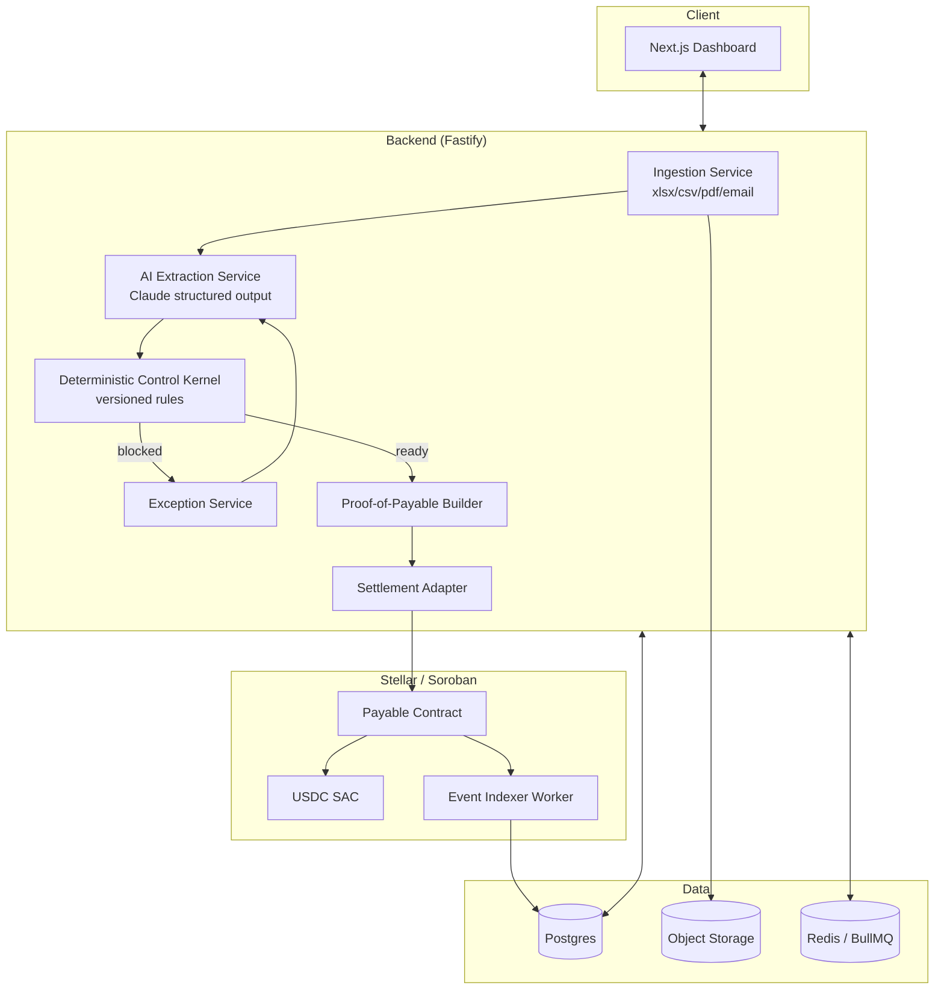

# Pakta — Plan de Implementación

**Versión:** 1.0
**Fecha:** 23 de septiembre de 2026
**Alcance:** stack técnico, arquitectura de infraestructura y plan de ejecución para pasar del mockup de frontend a un MVP funcional (Fase 1 del roadmap del Documento Maestro, sección 24) y su evolución hacia piloto (Fase 2).

> Este documento complementa `Pakta_Documento_Maestro.md`. No repite la tesis de producto; se enfoca en **cómo se construye**.

---

## 1. Principio de arquitectura

Tres capas con responsabilidades estrictamente separadas, tal como exige la sección 9 y 19 del documento maestro:

```text
┌─────────────────────────────────────────────────┐
│  AI / AGENTIC LAYER (probabilística)             │
│  extrae, clasifica, propone matches, redacta     │
└─────────────────────────────────────────────────┘
                      ↓ propuesta, nunca autorización
┌─────────────────────────────────────────────────┐
│  DETERMINISTIC CONTROL KERNEL (backend)          │
│  reglas versionadas, exceptions, Proof-of-Payable│
└─────────────────────────────────────────────────┘
                      ↓ solo si READY
┌─────────────────────────────────────────────────┐
│  SETTLEMENT LAYER (Soroban + Stellar)            │
│  invariantes on-chain, transfer, eventos         │
└─────────────────────────────────────────────────┘
```

Regla de diseño no negociable: **el LLM nunca escribe directamente al kernel determinístico ni firma settlement**. Toda salida de AI pasa por un contrato de tipos (structured output) que el kernel valida como cualquier otro input no confiable.

---

## 2. Stack técnico

### 2.1 Frontend

| Componente | Elección | Motivo |
|---|---|---|
| Framework | Next.js 15 (App Router) + React 19 | SSR para dashboard, server actions para mutaciones simples, un solo repo para UI |
| Lenguaje | TypeScript estricto | Los tipos de Payable/Exception/Proof se comparten con el backend |
| Estado UI | TanStack Query | Cache y revalidación de payables/exceptions sin Redux |
| Componentes | shadcn/ui + Tailwind | Velocidad de hackathon, consistente con el mockup ya construido |
| Tablas grandes | TanStack Table | Payables queue con cientos de filas |
| Realtime | Server-Sent Events o Supabase Realtime | Reflejar `BLOCKED → REVALIDATING → READY → SETTLED` sin polling agresivo |

El mockup ya publicado (Control Room) sirve como spec visual: pills de estado, side panel de exception, evidence checklist, proof viewer y reconciliation chain se reconstruyen como componentes reales sobre datos verdaderos.

### 2.2 Backend / Deterministic Control Kernel

| Componente | Elección | Motivo |
|---|---|---|
| Runtime | Node.js 22 + TypeScript | Comparte tipos con frontend, ecosistema maduro para integraciones (Stellar SDK, parsers) |
| Framework API | Fastify (o Next.js Route Handlers si se prioriza monorepo simple) | Bajo overhead, buen soporte de schemas (Zod/TypeBox) |
| Validación | Zod en el límite de cada input (AI output, uploads, webhooks) | El kernel nunca confía en un objeto sin validar, incluida la salida del LLM |
| Rules engine | Módulo TypeScript propio, versionado (`policy_version`), no un motor de reglas genérico de terceros | El documento maestro exige reglas explícitas, auditable y versionadas — no una black box |
| Jobs / colas | BullMQ sobre Redis | Reintentos de revalidación, notificaciones, polling de eventos Soroban |
| Auth | Clerk o Auth.js + roles (AP, Procurement, Vendor Master, Treasury, Controller) | Mapear directamente a los `owner_role` de las exceptions (sección 10 del maestro) |

### 2.3 Datos

| Componente | Elección | Motivo |
|---|---|---|
| Base de datos | PostgreSQL (Supabase o RDS) | Relacional: Vendor, PO, Invoice, Receipt, Payable, Exception, ProofOfPayable, Settlement como tablas con foreign keys reales |
| Storage de documentos | S3 / Supabase Storage | PDFs e inputs originales quedan off-chain (sección 13.1); solo se guarda el hash |
| Vector/búsqueda (opcional Fase 2) | pgvector | Matching difuso invoice↔PO cuando no hay IDs exactos |

Canonical Payable Model (sección 7.0) se implementa como el esquema Postgres central; el workbook Excel es solo un **adapter de entrada**, no el modelo de datos.

### 2.4 AI / Agentic layer

| Componente | Elección | Motivo |
|---|---|---|
| Modelo principal | Claude (Sonnet/Opus vía API) con structured output (tool use) | Extracción de invoices/PO, clasificación de emails, redacción de resúmenes de exception |
| Orquestación de agentes | Claude Agent SDK o LangGraph si se necesita multi-agent explícito (Payables Agent → Vendor Verification Agent → Operations Agent, sección 9.3) | Mantiene cada agente con tool-boundaries estrictos |
| Document parsing | Claude con vision para PDFs/escaneados + fallback OCR (Tesseract) | PDFs de invoices no siempre son texto nativo |
| Contrato de salida | JSON Schema estricto por tipo de tarea (extracción, matching, exception summary) | Cualquier campo fuera de schema se descarta antes de llegar al kernel |

### 2.5 Blockchain / Settlement

| Componente | Elección | Motivo |
|---|---|---|
| Smart contracts | Soroban (Rust) | Definido en sección 19 del maestro: estado mínimo de Payable + invariantes |
| SDK | `stellar-sdk` (JS/TS) + `soroban-client` | Integración desde el backend Node |
| Asset | USDC vía Stellar Asset Contract (SAC) | Settlement real en testnet |
| Indexer de eventos | Stellar RPC (`getEvents`) consumido por un worker propio | Captura `payable_ready`, `settlement_executed`, `payable_reconciled` para reconciliation |
| Auth on-chain | SEP-10 (y SEP-45 si se usa contract account) | Prueba de control de address, no de identidad legal del vendor (ver 8.6 del maestro) |
| Custodia | Ninguna — la empresa mantiene sus keys o smart account | Cumple "Sovereignty of funds" (sección 12.1) |

### 2.6 Infraestructura y DevOps

| Componente | Elección | Motivo |
|---|---|---|
| Hosting frontend | Vercel | Deploy inmediato desde el mismo repo Next.js |
| Hosting backend/workers | Fly.io o Railway para hackathon; migrar a AWS (ECS Fargate) en piloto | Bajo setup inicial, ruta clara de escalamiento |
| Base de datos gestionada | Supabase (Postgres + Storage + Auth opcional) | Un solo proveedor cubre DB, storage y realtime en el MVP |
| Secrets | Doppler o Vercel/Fly secrets | Keys de Stellar, API keys de Claude, nunca en el repo |
| CI/CD | GitHub Actions: lint + typecheck + tests en PR, deploy automático en merge a `main` | Estándar, sin fricción |
| Monitoreo | Sentry (errores) + logs estructurados (pino) → Axiom o Logtail | Trazabilidad de exceptions reales del sistema (no confundir con las "exceptions" de negocio) |
| Contratos Soroban | Deploy y pruebas con Soroban CLI + `soroban-test` en testnet | Pipeline separado del backend, versionado por contrato |

---

## 3. Arquitectura de servicios (MVP)



### Servicios y su responsabilidad

1. **Ingestion Service** — normaliza xlsx/CSV/PDF/email al Canonical Payable Model. Un adapter por fuente; agregar QuickBooks/Odoo/Zoho en Fase 2 es un adapter nuevo, no un rediseño.
2. **AI Extraction Service** — llama a Claude con schemas estrictos; cada salida se marca `confidence` y `source_excerpt` para auditabilidad. Nunca escribe directo a `payables`; escribe a una tabla `extraction_proposals` que el kernel consume.
3. **Deterministic Control Kernel** — evalúa las reglas de la sección 7.3 del maestro (`invoice.vendor_id == po.vendor_id`, tolerancias, duplicados, wallet attestation, approvals, budget, expiry). Cada regla es una función pura testeable con unit tests.
4. **Exception Service** — crea el objeto típico (`reason_code`, `owner_role`, `required_action`, `auto_revalidate`), enruta notificación (email/webhook) y expone el endpoint de resolución que dispara revalidación.
5. **Proof-of-Payable Builder** — arma el objeto firmado/hasheado (sección 6.1) y lo persiste antes de invocar settlement.
6. **Settlement Adapter** — decide el rail (SAC / x402 / MPP, sección 15) y llama al contrato Soroban.
7. **Event Indexer Worker** — consume eventos on-chain y actualiza `settlements` + dispara reconciliation export.

---

## 4. Estructura de repositorio propuesta

```text
pakta/
├── apps/
│   ├── web/                 # Next.js dashboard (evoluciona del mockup)
│   └── api/                 # Fastify backend
├── packages/
│   ├── canonical-model/     # tipos TS compartidos: Payable, Exception, Proof, Settlement
│   ├── rules-kernel/        # deterministic control kernel, testeable de forma aislada
│   ├── ai-schemas/          # JSON Schemas / Zod para structured output de Claude
│   └── stellar-sdk-wrapper/ # helpers sobre stellar-sdk/soroban-client
├── contracts/
│   └── payable-contract/    # Soroban / Rust
├── infra/
│   ├── github-actions/
│   └── terraform/           # (Fase 2, cuando se migra a AWS)
└── Pakta_Documento_Maestro.md
```

Monorepo con pnpm workspaces + Turborepo: permite que frontend y backend compartan `canonical-model` sin duplicar tipos, que es exactamente el riesgo que el maestro señala en 3.2 ("PO, invoice, receipt, vendor master, approvals y payment rail viven en sistemas diferentes").

---

## 5. Modelo de datos (núcleo)

```text
vendors        (id, legal_name, status, active_wallet_id)
vendor_wallets (id, vendor_id, address, attestation_status, version, created_at)
purchase_orders(id, vendor_id, amount, status, approver_id)
invoices       (id, po_id, vendor_id, amount, due_date, wallet_address, source_hash)
receipts       (id, po_id, confirmed_qty, confirmed_by, confirmed_at)
approvals      (id, object_type, object_id, policy_version, approver_id, timestamp)
payables       (id, invoice_id, po_id, status, policy_version, expires_at)
exceptions     (id, payable_id, reason_code, severity, owner_role, required_action, resolved_at)
proofs         (id, payable_id, invoice_hash, po_hash, receipt_hash, approvals_hash, amount, asset, status)
settlements    (id, payable_id, tx_hash, ledger, network, erp_posting_status)
```

Este esquema es 1:1 con los JSON de ejemplo de las secciones 6.1, 6.2 y 6.3 del documento maestro — el objetivo es que el Proof-of-Payable y la Exception que ve el usuario sean una proyección directa de estas tablas, no un objeto inventado en la capa de presentación.

---

## 6. Plan de ejecución por fases

### Fase 1 — MVP hackathon (2-3 semanas, ejecutable en sprint de hackathon)

**Semana 1 — Fundaciones**
- Monorepo + `canonical-model` + esquema Postgres.
- Ingestion Service: import de `.xlsx` con las 6 hojas (`VENDORS, PO, INVOICES, RECEIPTS, APPROVALS, PAKTA_STATUS`).
- Deterministic Control Kernel con las 8 reglas de la sección 7.3, con tests unitarios por regla.
- Dashboard: tabla de payables + side panel de exception, reemplazando el mockup con datos reales de la API.

**Semana 2 — AI + Exceptions + Contrato**
- AI Extraction Service: parsing de invoice PDF/email con Claude structured output.
- Exception Service con los 5-8 reason codes de la sección 10, notificación por email/webhook.
- Contrato Soroban: estado mínimo (`Payable`), funciones `register_payable`, `submit_proof`, `block_payable`, `resolve_exception`, `revalidate`, `settle`, `expire`.
- Deploy en testnet.

**Semana 3 — Settlement + Reconciliation + Demo**
- Settlement Adapter conectando Proof-of-Payable → contrato → USDC/SAC transfer.
- Event Indexer Worker + reconciliation export de vuelta a Excel/CSV.
- Dashboard: proof viewer y reconciliation chain (ya prototipados en el mockup).
- Ensayo del demo script completo (sección 25 del maestro) con las 5 invoices de ejemplo.

**Criterio de éxito de Fase 1:** correr el escenario de la sección 17.3 end-to-end — 5 invoices, 1 READY inicial, 4 BLOCKED, 2 exceptions resueltas y revalidadas, 3 settlements reales en testnet, 3/3 reconciliados, 0 settlements no autorizados.

### Fase 2 — Piloto SME (1-2 meses)

- Connector de email inbox (IMAP/Gmail API) para invoice ingestion automática.
- Un connector contable real elegido según entrevistas (QuickBooks u Odoo primero).
- Policy builder configurable (YAML de la sección 18.4) expuesto en UI, no solo en config file.
- Flujo de supplier portal / wallet verification (para resolver `VENDOR_WALLET_CHANGED` sin intervención manual del lado interno).
- Migración de hosting backend a AWS (ECS Fargate) si el piloto lo justifica; mantener Vercel para frontend.
- Revalidation at execution time (sección 14.3): chequeo final antes de `settle()`.

### Fase 3 — Operación agentic (según roadmap, sección 24)

- Multi-agent real vía Claude Agent SDK: Payables Agent, Vendor Verification Agent, Operations Agent, Approval Agent, Settlement Agent como procesos independientes con tool-boundaries.
- Scheduled payable runs (cron) + priorización por riesgo/amount/due date.
- MCP/A2A tools para que el sistema sea invocable por agentes externos del cliente.

No se detalla infraestructura de Fase 4/5 (protocolo abierto, SAP/Oracle) aquí: depende de validación comercial (sección 23 del maestro) antes de comprometer diseño técnico.

---

## 7. Decisiones explícitas fuera de alcance del MVP

Coherente con la sección 18.1 del maestro ("Fuera del MVP"):

- Sin custodia de fondos — nunca se guardan private keys del treasury en el backend de Pakta.
- Sin GL/subledger completo — Pakta exporta reconciliation data, no reemplaza contabilidad.
- Sin KYC/KYB de producción.
- Sin privacidad avanzada (ZK, selective disclosure) — hashes simples como tamper-evident reference, como aclara la sección 13.2.
- Un solo proof issuer (el propio backend de Pakta) — se documenta como confianza centralizada explícita, con ruta de escalamiento a multi-attestor en Fase 4 (sección 19.3).

---

## 8. Riesgos técnicos a vigilar desde el día uno

| Riesgo | Mitigación |
|---|---|
| AI extraction alucina un campo que el kernel trata como válido | AI nunca escribe a `payables` directo; pasa por `extraction_proposals` con confidence score y el kernel re-verifica contra fuentes deterministas (PO, receipt) antes de aceptar |
| Ventana entre proof generado y settlement ejecutado | Revalidation check justo antes de `settle()` (sección 14.3), implementado desde Fase 1 aunque sea simple |
| Replay de un proof ya usado | `nonce` en el contrato Soroban + unicidad de `payable_id` en Postgres |
| Falla de posting a ERP después de settlement confirmado | `erp_posting_status` como campo explícito con reintentos vía BullMQ, nunca asumir que settlement = reconciliado |
| Prompt injection desde el contenido de un invoice/email | El AI Extraction Service trata todo el contenido del documento como dato, nunca como instrucción; el schema de salida no incluye campos de control de flujo |

---

*Este plan se actualiza a medida que la validación comercial (sección 23 del Documento Maestro) confirme o descarte supuestos de integración y de buyer.*
