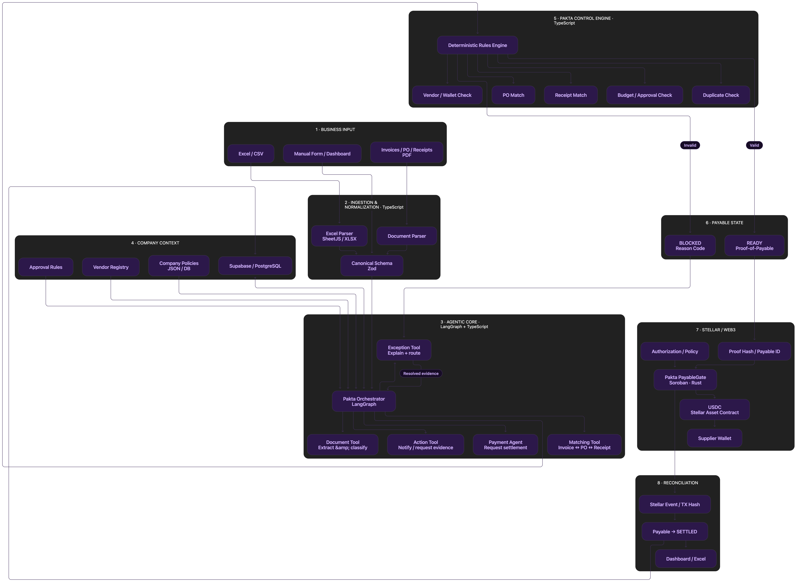

# Pakta

### Enterprise-Grade Agentic Payments Infrastructure for SMEs

> **Enterprise financial infrastructure, without enterprise complexity.**

Pakta convierte el flujo financiero real de una PyME —Excel, PDFs, email, apps contables— en un proceso **agentic verificable**: entiende la evidencia, resuelve excepciones y solo permite que el dinero se mueva cuando la obligación es realmente válida.

---

## Entregable para la hackathon

### Problema que resuelve

Una PyME puede tener una factura, orden de compra y aprobación aparentemente válidas, pero todavía pagar dos veces, pagar un monto equivocado o enviar fondos a una wallet de proveedor que cambió sin verificar. Pakta reúne esas evidencias, bloquea obligaciones con excepciones concretas y solo autoriza el pago cuando el payable está listo.

### ¿Cómo usa Stellar?

El contrato Soroban [`PayableGate`](contracts/payable-contract/src/lib.rs) controla el settlement en Stellar. Un issuer firma el **Proof-of-Payable**; `register_payable` comprueba la firma y fija en cadena el destinatario, activo, monto, vencimiento y hash del proof. Luego, el executor llama `settle(payable_id)`: esa función no acepta un destinatario ni un monto nuevos y transfiere exactamente lo registrado desde un vault con límites. La API enlaza la transacción y los eventos con la factura para reconciliación. El activo de esta demostración es **USDC de prueba emitido por Pakta**, no USDC de Circle ni dinero real.

### GitHub y evidencia on-chain (testnet)

- **GitHub:** [github.com/devmondoss/pakta](https://github.com/devmondoss/pakta)
- **Licencia:** [MIT](LICENSE), visible en la raíz del repositorio.
- **Contrato PayableGate v4:** `CBTQDZBJYL2JFQAT64OZYFK4PFOA3EG7CMVZ44FCBSAPDE5EXMTACS6S`
- **Inicialización de v4:** [`e895036e…cad7c1408`](https://horizon-testnet.stellar.org/transactions/e895036e5657e3c8951c67cb894f7e6e6b037e93ca44de63c034284cad7c1408)
- **Actualización a v4:** [`67867c2f…d65b531220`](https://horizon-testnet.stellar.org/transactions/67867c2f3b7f425cc3b614d0ab6569b027890e22d313108581f7a0885b531220)
- **Fondeo del vault:** [`74f1eba3…22ec9cb`](https://horizon-testnet.stellar.org/transactions/74f1eba311eb89057df57a02c6a6381419fbaafc3933d07dfc1ad6db322ec9cb)
- **Manifiesto público:** [`deployments/testnet.json`](deployments/testnet.json), con ID, red, hash WASM y hashes de transacciones; no contiene claves privadas.

Verificación directa realizada el 25 de septiembre de 2026: el contrato responde `contract_version() = 4`, su hash WASM es `c598ec442ca216581a71b61f3e89eb02644613280e3f5aa24d65b471e92f0948`, y reporta 61 000 USDC de prueba disponibles y 0 comprometidos. Las tres transacciones de v4 enlazadas arriba figuran como exitosas en Horizon. Las cinco wallets del demo tienen XLM de testnet y trustline del activo; eso no implica que las cinco hayan recibido pagos.

El manifiesto también conserva una [transacción de settlement funcional](https://horizon-testnet.stellar.org/transactions/c2001f73217090e30069f513eab8f7999428667a24de5caf26ab3f3ed370ddc4) del **24 de septiembre de 2026**, anterior al despliegue de v4 del día 25. Es evidencia de una versión previa; aún no se presenta como un settlement de v4. Stellar [reinicia testnet periódicamente](https://developers.stellar.org/docs/networks), por lo que el estado y los enlaces deben comprobarse de nuevo al presentar la entrega.

---

## 🧩 La tesis en una frase

> Una PyME sufre los mismos problemas de Accounts Payable, control y reconciliación que una gran empresa, pero no tiene el stack de SAP/AWS/Bitwave para resolverlos.

El *payment rail* responde **"¿podemos mover el dinero?"**. El *agent wallet* responde **"¿el agente está autorizado a actuar?"**. **Pakta responde la pregunta que nadie más responde:**

> **"¿esta obligación empresarial específica está realmente lista para pagarse, a este destinatario, por este monto, ahora?"**

Cuando las condiciones se cumplen, Pakta emite un **Proof-of-Payable** y habilita el settlement en Stellar (USDC). Cuando no se cumplen, no devuelve un error genérico: crea una **excepción tipada** con causa, dueño y acción requerida — y revalida automáticamente en cuanto se resuelve.

---

## ⚙️ Cómo funciona

```text
Excel / CSV / PDF / Email / Accounting App
                    ↓
              AI INGESTION
 extract · classify · match · request missing evidence
                    ↓
         DETERMINISTIC VERIFICATION
 PO · invoice · receipt · vendor · wallet · approvals · policy
              ↙                 ↘
       EXCEPTION              READY
 reason + owner                 ↓
 notify + resolve        Proof-of-Payable
       ↓                         ↓
    revalidate           Stellar / USDC
              ↘                 ↓
               SETTLEMENT PROOF
                      ↓
              Reconciliation
```

La IA nunca es la autoridad final sobre el dinero: **interpreta y propone**, pero un **kernel de verificación determinístico** decide si el payable puede liquidarse. Esa es la distinción central de Pakta frente a "un LLM con acceso al treasury".

### Recorrido de la demo

1. En **Cargar dataset**, elegí una industria. Pakta ingesta un lote nuevo con IDs únicos para esa corrida y lo evalúa contra la política vigente.
2. Las obligaciones con evidencia completa quedan en `READY`; las que no cumplen muestran una excepción concreta, su responsable y la acción necesaria para resolverla.
3. Cuando el settlement de testnet está habilitado, Pakta envía los payables `READY` **uno por uno** a `PayableGate`. La secuencia evita colisiones de nonce de la cuenta ejecutora de Stellar.
4. Cada settlement exitoso se vincula con su `tx_hash`, ledger y `proof_hash`; el conector de demo marca automáticamente el posteo ERP como `RECONCILED`.
5. El diálogo de cierre aparece solo cuando ya no quedan payables `READY` de esa corrida. Muestra la cantidad y el **total acumulado de todos los pagos liquidados**, no solo el último.

El lote puede contener de 5 a 10 facturas: las excepciones se mantienen visibles como casos de control y los payables `READY` recorren automáticamente settlement y reconciliación. La notificación de cierre es una simulación visual del demo; la transacción de Stellar y los registros de actividad sí quedan trazados.

### El caso que resume la tesis: `VENDOR_WALLET_CHANGED`

Invoice, PO, receipt, monto, presupuesto y firma del agente pueden estar perfectos — pero si el proveedor cambió su wallet de destino, esa relación **todavía no está probada**. Pakta bloquea el pago, crea una excepción con owner (`Vendor Master / Treasury`) y acción requerida (`Reverify wallet ownership`), y **revalida automáticamente** en cuanto se confirma la nueva wallet.

---

## 🏗️ Arquitectura



| Capa | Responsabilidad |
|---|---|
| **Ingestion & Normalization** | Convierte Excel/CSV/PDF/email a un **Canonical Payable Model** común (Zod) |
| **Agentic Core** (LangGraph) | Extrae, clasifica, matchea invoice↔PO↔receipt y explica/enruta excepciones |
| **Pakta Control Engine** | Motor de reglas determinístico y versionado: vendor/wallet check, PO match, receipt match, budget/approval check, duplicate check |
| **Company Context** | Vendor registry, approval rules y policies como fuente de verdad (Supabase/PostgreSQL) |
| **Payable State** | `BLOCKED` (con reason code) o `READY` (con Proof-of-Payable) |
| **Stellar / Web3** | Soroban `PayableGate` (Rust) autoriza el `transfer` sobre el Stellar Asset Contract (USDC) hacia la wallet del proveedor |
| **Reconciliation** | Los eventos/tx hash de Stellar se ligan de vuelta al payable original y se exportan al dashboard/Excel |

**Principio de diseño:** la IA orquesta operaciones, el settlement queda sujeto a un *deterministic gate*. Documentos sensibles permanecen off-chain; en cadena solo viven hashes, estado y commitments mínimos.

---

## 🧱 Stack técnico

| | |
|---|---|
| **Frontend** | Next.js 16 + React 19 · TypeScript · Tailwind |
| **Backend** | Node.js ≥22 + TypeScript · Fastify · Zod |
| **Datos** | PostgreSQL vía Neon |
| **AI / Agentic** | NVIDIA NIM (API compatible con OpenAI) detrás de una interfaz de extracción agnóstica de proveedor |
| **Blockchain** | Soroban (Rust) · Stellar SDK · USDC vía Stellar Asset Contract (SAC) · SEP-10/SEP-45 |
| **Infra** | Vercel · Fly.io/Railway → AWS ECS · GitHub Actions · Sentry |

En el MVP, Treasury conserva sus claves y prefondea un **vault Soroban con custodia acotada del float**. Treasury fija límites por payable y por ventana; el contrato transfiere de su propio saldo solo a destinatarios y montos vinculados al proof firmado. Una contract account sin custodia queda como evolución posterior.

---

## 🎯 Qué es y qué no es

**Pakta es:** ingestion adaptativa + orquestación con AI + controles determinísticos + resolución de excepciones + settlement verificable + puente de reconciliación.

**Pakta no es:** otro ERP, un LLM con acceso libre al treasury, un custodio de claves privadas, un reemplazo de x402/MPP, un ledger contable completo, ni un requisito de guardar documentos empresariales on-chain.

---

## 🗺️ Roadmap

1. **Research/validación** — entrevistas SME y payment/stablecoin providers
2. **MVP hackathon** — `.xlsx` → ingestion → reglas → excepciones → Proof-of-Payable → settlement en Soroban/testnet → reconciliación
3. **Piloto SME** — conectores de email/QuickBooks/Odoo/Zoho, policy builder, verificación de wallet de proveedores
4. **Operación agentic** — agentes autónomos de seguimiento, herramientas MCP/A2A, resolución multi-paso
5. **Plataforma/protocolo** — schema público de Proof-of-Payable, reason codes estándar, adapters de settlement
6. **Expansión enterprise** — conectores SAP/Oracle, RBAC avanzado, privacidad selectiva

---

## 🚀 Ejecutarlo localmente

```bash
pnpm install
cp .env.example .env
# completa DATABASE_URL en .env
pnpm --filter @pakta/api dev
pnpm --filter @pakta/web dev
```

La API se inicia en `http://localhost:4000` y el dashboard en
`http://localhost:3000`. `DATABASE_URL` es obligatoria; `NVIDIA_API_KEY` solo
es necesaria para la ingesta de PDFs. Para verificar el contrato Soroban:

```bash
pnpm contract:test
```

Para validar el monorepo, `pnpm test` ejecuta las pruebas que no necesitan
servicios externos. `pnpm test:integration` carga `DATABASE_URL` desde `.env` y
ejecuta en secuencia las suites de PostgreSQL, API y MCP sobre el esquema
`pakta_test`. En GitHub Actions, la suite de integración corre cuando está
configurado el secreto `PAKTA_TEST_DATABASE_URL`.

---

## 📄 Documentación

Toda la documentación vive en [`docs/`](docs/), organizada por categoría (`product`, `implementation`, `assets`) con sus tags — ver el [índice completo](docs/README.md).

- [`docs/product/Pakta_Documento_Maestro.md`](docs/product/Pakta_Documento_Maestro.md) — tesis de producto completa, arquitectura, modelo de excepciones, threat model y referencias
- [`docs/implementation/Pakta_Plan_Implementacion.md`](docs/implementation/Pakta_Plan_Implementacion.md) — stack técnico, arquitectura de servicios y plan de ejecución por fases
- [`docs/implementation/Pakta_Division_Trabajo.md`](docs/implementation/Pakta_Division_Trabajo.md) — división de trabajo del equipo (Web3/Settlement vs Agentic/AI)
- [`docs/implementation/Pakta_Arquitectura_Flujo.md`](docs/implementation/Pakta_Arquitectura_Flujo.md) — arquitectura y estado actual de los módulos
- [`docs/implementation/Pakta_Dev2_Checklist.md`](docs/implementation/Pakta_Dev2_Checklist.md) — estado de ingestion, extracción, API y dashboard

---

<p align="center"><i>Evidence before execution. Exceptions before loss. Proof before settlement.</i></p>
