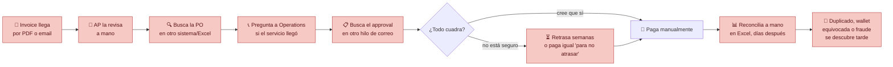
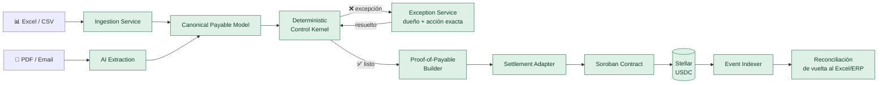
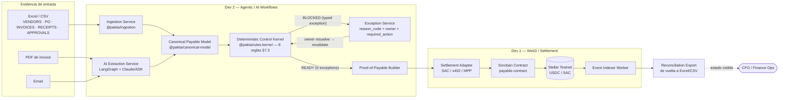
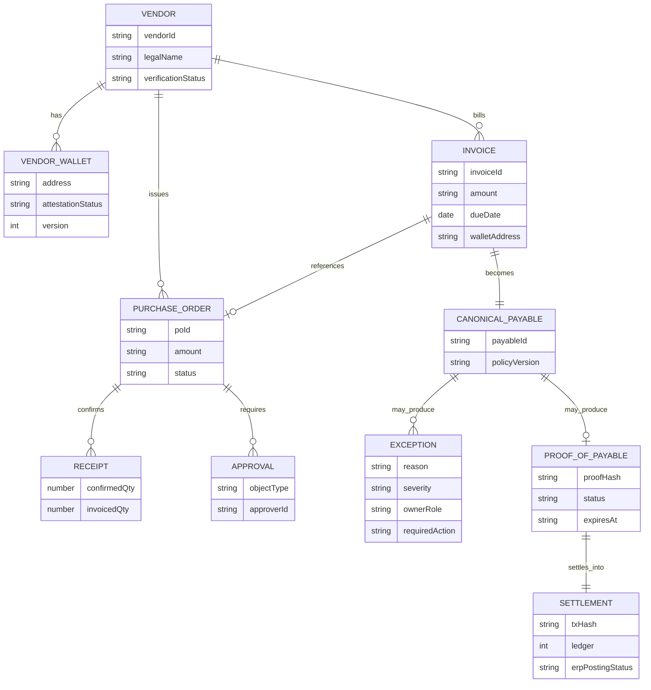
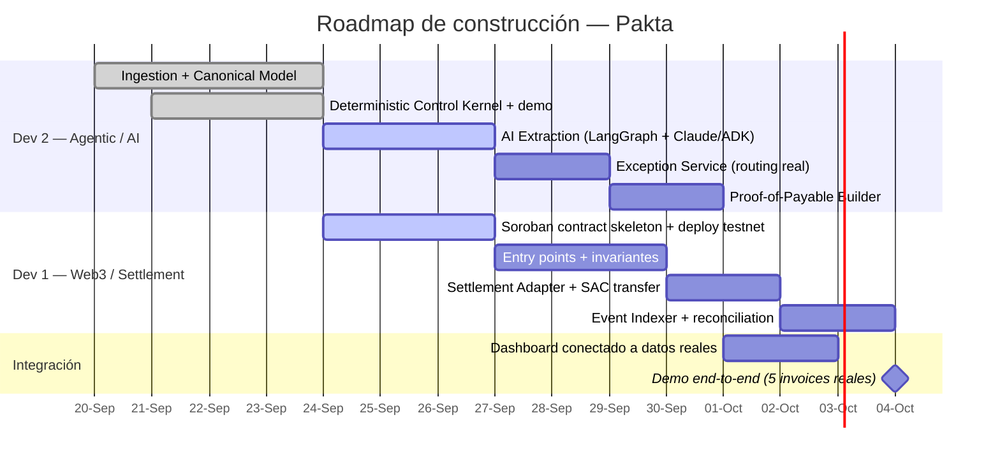
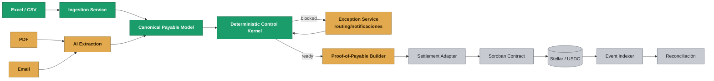
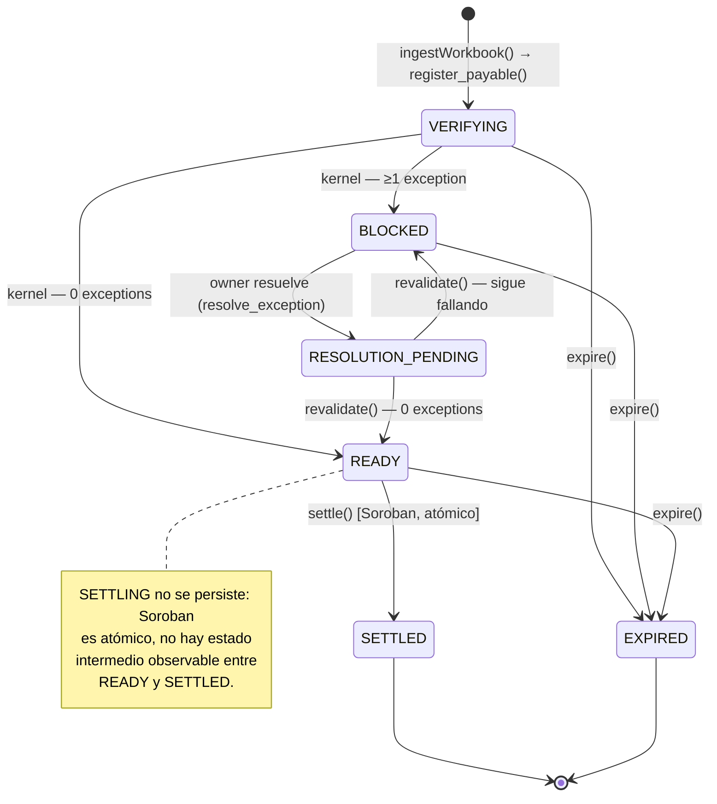
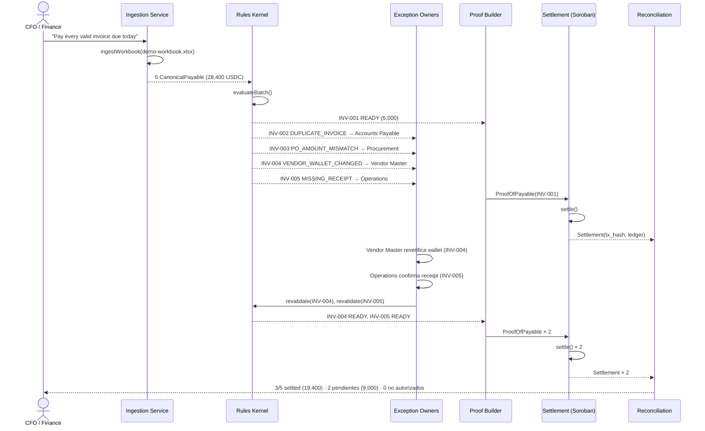

# Pakta — Esquema y Flujo Técnico

**Checkpoint intermedio — hackathon**
**Fecha:** 23 de septiembre de 2026
**Repositorio:** https://github.com/devmondoss/pakta
**Track:** 01 — AI Agents & Automated Workflows

> *"Programas o bots que pagan y cobran solos, sin que una persona apruebe cada movimiento — por ejemplo, un asistente que le paga automáticamente a otro programa por un servicio, o que reparte dinero entre varias personas según reglas que tú defines."*
> Pakta encaja directo: el agent es quien decide *qué* pagar, pero el pago mismo solo se ejecuta cuando el Deterministic Control Kernel confirma que la obligación cumple las reglas que la empresa definió — la autonomía del agente vive dentro de esas reglas, nunca por fuera de ellas.

> Qué problema resolvemos, cómo se resuelve hoy sin Pakta, cómo lo resuelve Pakta, la arquitectura completa (frontend, backend, datos, agentic/AI, blockchain, infra), el diagrama de procesos, el diagrama de datos, el diagrama de construcción (roadmap) y qué está construido hasta este checkpoint. Documentación completa: [`product/Pakta_Documento_Maestro.md`](../product/Pakta_Documento_Maestro.md) · [`implementation/Pakta_Plan_Implementacion.md`](Pakta_Plan_Implementacion.md) · [`implementation/Pakta_Division_Trabajo.md`](Pakta_Division_Trabajo.md).

---

## 1. El problema

Una SME tiene los mismos problemas de Accounts Payable que una gran empresa —facturas duplicadas, órdenes de compra que no cuadran, recepciones sin confirmar, cambios de wallet/cuenta bancaria del proveedor, aprobaciones pendientes, reconciliación manual— pero no tiene el stack de SAP/AWS/Bitwave para resolverlos. La evidencia vive repartida en Excel, PDFs, correos y, cuando existe, un software contable. Nadie tiene una vista única de "¿esta obligación está realmente lista para pagarse?" antes de que el dinero salga.

### Flujo tradicional (sin Pakta)



**El costo real:** 63% de equipos de AP dedica más de 10 horas/semana a procesar invoices, 66% todavía hace entrada manual al ERP (IFOL, 2025), y 79% de organizaciones sufrió intentos de fraude de pagos en 2024 (AFP, 2025) — buena parte por cambios de cuenta/wallet del proveedor no verificados.

---

## 2. La solución — Pakta

Pakta se conecta con la evidencia que la empresa **ya tiene** (Excel, PDFs, email), usa AI para leerla y relacionarla, pero **nunca deja que un modelo probabilístico autorice un pago**: un motor de reglas determinístico decide si el payable está listo, y solo entonces se emite un **Proof-of-Payable** que habilita el settlement en Stellar. Cuando algo no cuadra, no es un error genérico — es una excepción tipada con dueño y acción exacta, que se revalida sola en cuanto se resuelve.

### Flujo propuesto (con Pakta)



> **La diferencia:** el payment rail responde "¿podemos mover el dinero?". Pakta responde **"¿esta obligación específica está realmente lista para pagarse, a este destinatario, por este monto, ahora?"** — antes de que el dinero se mueva, no después.

---

## 3. Arquitectura del sistema

Stack real, sin nada especulativo que no vayamos a usar en el hackathon: nada de autenticación ni colas de jobs todavía — se agregan solo si el flujo realmente lo exige más adelante.

### Frontend

| Componente | Elección |
|---|---|
| Framework | Next.js (App Router) + React + TypeScript |
| UI | Tailwind + shadcn/ui — ya prototipado en el mockup del Control Room |
| Estado / datos | TanStack Query contra la API del backend |
| Auth | **Ninguna por ahora.** No la necesita el demo del hackathon; se evalúa si el piloto real la requiere |

### Backend

| Componente | Elección |
|---|---|
| Runtime | Node.js 24 + TypeScript |
| API HTTP | Fastify — se conecta cuando el dashboard necesite datos reales; hoy el kernel corre como librería pura (`pnpm test`), sin servidor |
| Colas / jobs | **Ninguna por ahora.** No hay nada asíncrono en el flujo actual que lo justifique |
| Validación | Zod en cada frontera de confianza (spreadsheet, salida de IA, requests) |

### Datos

| Componente | Elección |
|---|---|
| Base de datos | PostgreSQL vía Supabase |
| Vector search | pgvector (ya incluido en Supabase) — **solo si** el matching difuso invoice↔PO en AI Extraction lo requiere; no se activa antes de necesitarlo |
| Storage de documentos | Supabase Storage (PDFs/evidencia original, off-chain) |

### Agentic / AI

| Componente | Elección |
|---|---|
| Orquestador de agentes | LangGraph |
| Modelo / SDK | Claude Agent SDK o Google Agent Development Kit (ADK) — por definir cuál encaja mejor con LangGraph durante la integración |
| Alternativa de bajo costo | NVIDIA NIM APIs (gratis, más lentas) como fallback si el volumen de llamadas lo justifica |
| Contrato de salida | Zod / structured output — la IA nunca escribe directo al kernel, siempre pasa por una `extraction_proposal` validada |

### Blockchain

| Componente | Elección |
|---|---|
| Smart contract | Soroban (Rust) — `contracts/payable-contract` |
| SDK / CLI | Stellar SDK (JS/TS) + Stellar CLI |
| Settlement | USDC vía Stellar Asset Contract (SAC), Stellar Testnet |
| Eventos | Stellar RPC `getEvents`, consumidos por el Event Indexer Worker |

### Infraestructura / DevOps

| Componente | Elección |
|---|---|
| Hosting frontend | Vercel |
| Hosting backend | Fly.io / Railway (fase de piloto) |
| CI | GitHub Actions |
| Monorepo | pnpm workspaces (ya configurado — `packages/canonical-model`, `packages/ingestion`, `packages/rules-kernel`) |

---

## 4. Diagrama de procesos — pipeline end-to-end

Mismo flujo de las secciones 1-2, ahora con el detalle de quién construye cada bloque (`Pakta_Division_Trabajo.md`): **Dev 2** posee todo lo anterior al Proof-of-Payable, **Dev 1** todo lo posterior.



---

## 5. Diagrama de datos — Canonical Payable Model

Implementado en `@pakta/canonical-model` (`packages/canonical-model/src/schemas.ts`, `exception.ts`, `proof.ts`).



`ProofOfPayable` y `Settlement` son el **único contrato compartido** entre Dev 1 y Dev 2 (`Pakta_Division_Trabajo.md` §5) — viven en `@pakta/canonical-model` para que nadie los reinvente de un lado u otro.

---

## 6. Diagrama de construcción — roadmap

Fechas estimadas desde hoy (23 sep), sujetas a ajuste según el cronograma final del hackathon.



---

## 7. Qué hemos construido hasta este checkpoint



🟢 **Construido y testeado** (`main`, 45/45 tests) · 🟠 **Siguiente en la fila** · ⚪ **Planeado**

| Módulo | Estado | Detalle |
|---|:---:|---|
| Ingestion Service (`@pakta/ingestion`) | 🟢 | `.xlsx`/`.csv` → Canonical Payable Model, ExcelJS, rechazo fila-por-fila sin abortar el batch |
| Canonical Payable Model (`@pakta/canonical-model`) | 🟢 | Schemas Zod (Vendor, PO, Invoice, Receipt, Approval, Exception) + contrato `ProofOfPayable`/`Settlement` compartido con Dev 1 |
| Deterministic Control Kernel (`@pakta/rules-kernel`) | 🟢 | Las 8 reglas de §7.3, mapeadas 1:1 a `reason_code`/`owner_role`/`required_action` de §10 |
| Fixture del demo canónico (5 invoices, 28,400 USDC) | 🟢 | End-to-end: 1 READY + 4 BLOCKED exactos, reproducible con `pnpm test` |
| AI Extraction Service (LangGraph, PDF/email → structured output) | 🟠 | En curso |
| Exception Service (routing/notificaciones reales) | 🟠 | Siguiente — hoy el kernel produce el objeto `Exception`, falta el enrutamiento/notificación |
| Proof-of-Payable Builder | 🟠 | Siguiente |
| Soroban Contract (`payable-contract`) | ⚪ | Dev 1 — no iniciado en este checkpoint |
| Settlement Adapter + Event Indexer | ⚪ | Dev 1 |
| Dashboard conectado a datos reales | ⚪ | Mockup ya prototipado, falta conectar |

**Resultado verificable hoy:**
```bash
pnpm install
pnpm test        # 45/45 passed
pnpm typecheck    # clean
```
Corre el fixture canónico de 5 invoices y produce, de forma determinística, 1 payable `READY` + 4 `BLOCKED` con el `reason_code`/`owner_role`/`required_action` exactos del documento maestro.

---

## 8. Diagrama de estados — ciclo de vida del `Payable`

Coherente entre lo que corre en `@pakta/rules-kernel` (off-chain, ya construido) y lo que va a aplicar el contrato Soroban (on-chain, Dev 1).



---

## 9. Diagrama de secuencia — demo canónico (5 invoices, `fixtures/demo-workbook`)

Corrida real contra el fixture ya implementado — no es hipotética, es el test de aceptación `demo-fixture.test.ts`.



---

## 10. Próximo paso

Dev 1 arranca `contracts/payable-contract` (Soroban): estado mínimo del `Payable`, los 7 entry points (`register_payable`, `submit_proof`, `block_payable`, `resolve_exception`, `revalidate`, `settle`, `expire`) y los invariantes de no-doble-settlement / no-sustitución de recipient-amount. Deploy de un esqueleto a testnet como primer hito verificable. En paralelo, Dev 2 conecta AI Extraction (LangGraph + Claude Agent SDK / Google ADK, con NVIDIA NIM como fallback de bajo costo) y arma el Exception Service real.
