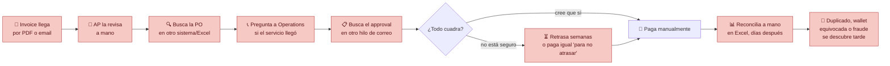
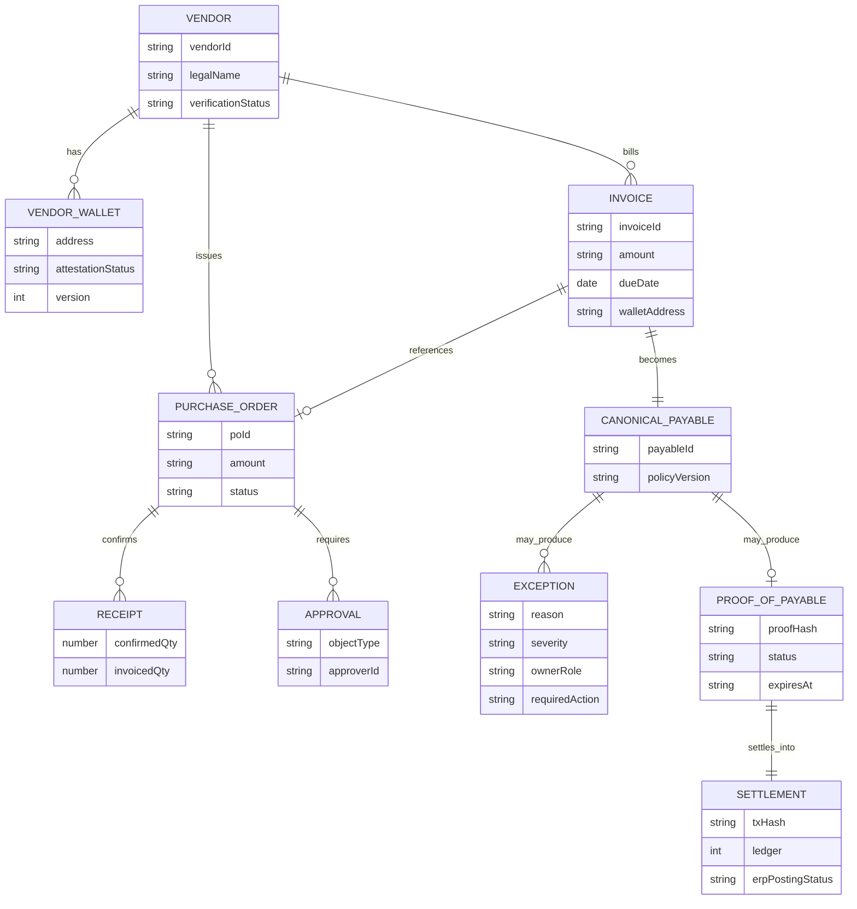
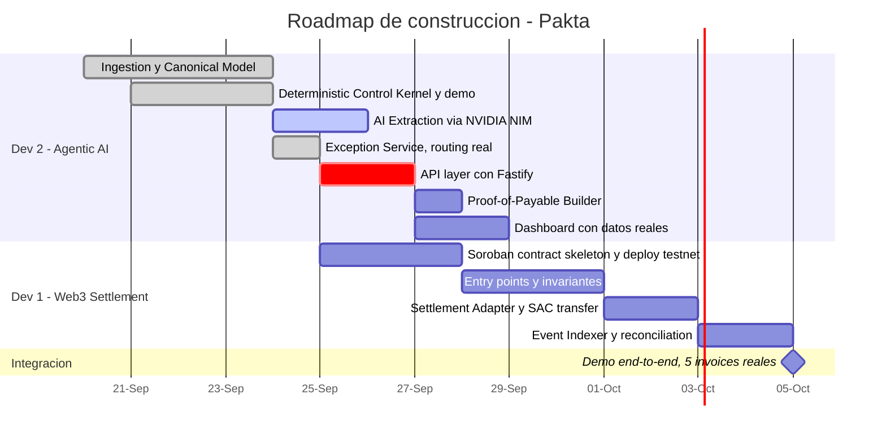
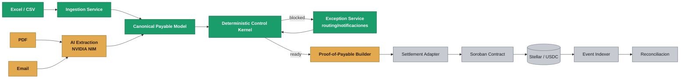
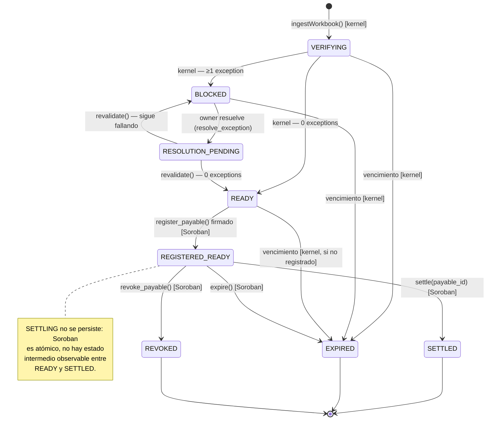
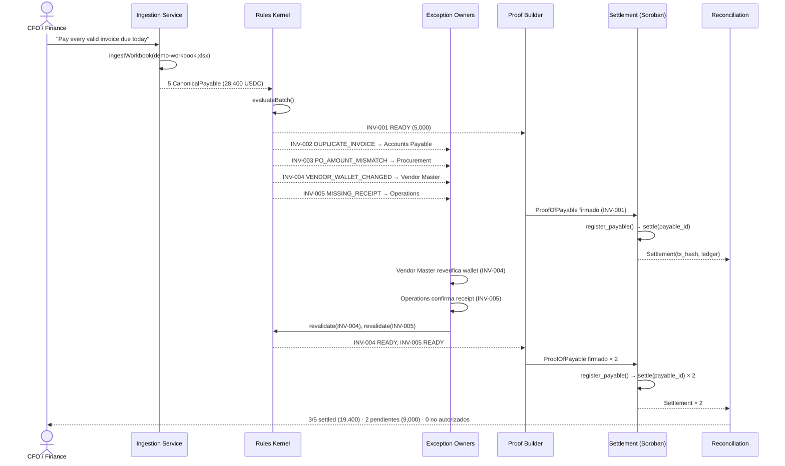
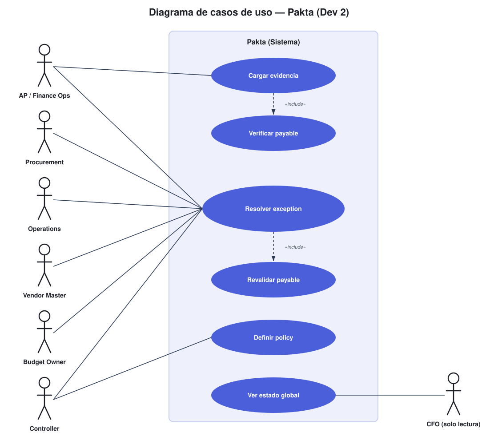

# Pakta — Esquema y Flujo Técnico

**Arquitectura y estado de implementación — hackathon**
**Última actualización:** 25 de septiembre de 2026
**Repositorio:** [https://github.com/devmondoss/pakta](https://github.com/devmondoss/pakta)

> Qué problema resolvemos, cómo se resuelve hoy sin Pakta, cómo lo resuelve Pakta, la arquitectura completa (frontend, backend, datos, agentic/AI, blockchain, infra), el diagrama de procesos, el diagrama de datos, el diagrama de construcción (roadmap), el diagrama de casos de uso y qué está construido hasta este checkpoint.

### Este documento es el hub

Todo lo demás en `docs/` es un **complemento** de este archivo, no un documento aparte que vive por su cuenta — la idea es que cualquier duda técnica se resuelva primero acá, y solo se baje al complemento correspondiente cuando haga falta el detalle fino:


| Complemento                                                                   | Para qué bajar ahí                                                                                                        |
| ----------------------------------------------------------------------------- | ------------------------------------------------------------------------------------------------------------------------- |
| [Documento maestro](../product/Pakta_Documento_Maestro.md) | La tesis de producto completa, el modelo de datos §6-7 con ejemplos JSON, el modelo de exceptions §10 y el demo script §25. |
| [Plan de implementación](Pakta_Plan_Implementacion.md) | El plan de ejecución por fases y el detalle de la arquitectura objetivo. |
| [División de trabajo](Pakta_Division_Trabajo.md) | Historias de usuario, criterios de aceptación y DoD por comando para ambos devs. |
| [Checklist de Dev 2](Pakta_Dev2_Checklist.md) | Bitácora de ingestion, extracción, API y dashboard. |
| [Escenarios UX](Pakta_Escenarios_UX.md) | Los diagramas de este documento (§2, §4, §9) asumen siempre settlement en Stellar. Para el escenario sin crypto (área contable pura, settlement manual por banco) y el mapa de pantallas por rol de cada escenario, ver ese doc. |


---


## 0. Track del hackathon

**Track 01 — AI Agents & Automated Workflows**

> *"Programas o bots que pagan y cobran solos, sin que una persona apruebe cada movimiento — por ejemplo, un asistente que le paga automáticamente a otro programa por un servicio, o que reparte dinero entre varias personas según reglas que tú defines."*

Pakta encaja directo: el agente es quien decide **qué** pagar, pero el pago mismo solo se ejecuta cuando el Deterministic Control Kernel confirma que la obligación cumple las reglas que la empresa definió — la autonomía del agente vive **dentro** de esas reglas, nunca por fuera de ellas.

---


## 1. El problema

Una SME tiene los mismos problemas de Accounts Payable que una gran empresa —facturas duplicadas, órdenes de compra que no cuadran, recepciones sin confirmar, cambios de wallet/cuenta bancaria del proveedor, aprobaciones pendientes, reconciliación manual— pero no tiene el stack de SAP/AWS/Bitwave para resolverlos. La evidencia vive repartida en Excel, PDFs, correos y, cuando existe, un software contable. Nadie tiene una vista única de "¿esta obligación está realmente lista para pagarse?" antes de que el dinero salga.

### Flujo tradicional (sin Pakta)




**El costo real:** 63% de equipos de AP dedica más de 10 horas/semana a procesar invoices, 66% todavía hace entrada manual al ERP (IFOL, 2025), y 79% de organizaciones sufrió intentos de fraude de pagos en 2024 (AFP, 2025) — buena parte por cambios de cuenta/wallet del proveedor no verificados.

---


## 2. La solución — Pakta

Pakta se conecta con la evidencia que la empresa **ya tiene** (Excel, PDFs, email), usa AI para leerla y relacionarla, pero **nunca deja que un modelo probabilístico autorice un pago**: un motor de reglas determinístico decide si el payable está listo, y solo entonces se emite un **Proof-of-Payable**. Cuando algo no cuadra, no es un error genérico — es una excepción tipada con dueño y acción exacta, que se revalida sola en cuanto se resuelve. Lo que pasa **después** del Proof-of-Payable depende de si la empresa liquida en crypto o no — por eso el diagrama bifurca ahí, no antes.

### Flujo propuesto (con Pakta)

```mermaid
flowchart LR
    A1["📊 Excel / CSV"] --> ING["Ingestion Service"]
    A2["📧 PDF / Email"] --> AI["AI Extraction"]
    ING --> CPM["Canonical Payable Model"]
    AI --> CPM
    CPM --> KER["Deterministic<br/>Control Kernel"]
    KER -->|"❌ excepción"| EXC["Exception Service<br/>dueño + acción exacta"]
    EXC -->|"resuelto"| KER
    KER -->|"✅ listo"| PRF["Proof-of-Payable<br/>Builder"]
    PRF --> FORK{"¿Liquida<br/>en crypto?"}

    FORK -->|"Sí — Escenario B"| SET["Settlement Adapter"]
    SET --> SC["Soroban Contract"]
    SC --> STL[("Stellar<br/>USDC")]
    STL --> IDX["Event Indexer"]

    FORK -->|"No — Escenario A"| PAY["Tesorería paga por banco<br/>(fuera de Pakta)"]
    PAY --> MARK["Marcar como pagado"]

    IDX --> REC["Reconciliación<br/>de vuelta al Excel/ERP"]
    MARK --> REC

    classDef good fill:#dff0e6,stroke:#177a51,color:#0d3d29
    classDef manual fill:#f6c9c4,stroke:#b73b3b,color:#5a1414
    class ING,AI,CPM,KER,EXC,PRF,REC good
    class SET,SC,STL,IDX good
    class PAY,MARK manual
```




> **La diferencia:** el payment rail responde "¿podemos mover el dinero?". Pakta responde **"¿esta obligación específica está realmente lista para pagarse, a este destinatario, por este monto, ahora?"** — antes de que el dinero se mueva, no después.

> Detalle de pantallas por rol para cada rama del fork: [Escenarios UX](Pakta_Escenarios_UX.md) §2-3.

---


## 3. Arquitectura del sistema

Stack real, sin nada especulativo que no vayamos a usar en el hackathon: nada de autenticación ni colas de jobs todavía — se agregan solo si el flujo realmente lo exige más adelante.

### Frontend


| Componente     | Elección                                                                                             |
| -------------- | ---------------------------------------------------------------------------------------------------- |
| Framework      | Next.js (App Router) + React + TypeScript                                                            |
| UI             | Tailwind                                                                                              |
| Estado / datos | `fetch` contra la API de Fastify, sin caché para reflejar la evaluación en vivo                      |
| Auth           | **Ninguna por ahora.** No la necesita el demo del hackathon; se evalúa si el piloto real la requiere |


### Backend


| Componente   | Elección                                                                                                                           |
| ------------ | ---------------------------------------------------------------------------------------------------------------------------------- |
| Runtime      | Node.js ≥22 + TypeScript                                                                                                          |
| API HTTP     | Fastify — expone intake, policy, payables, proofs, wallets, receipts y settlement; el dashboard ya la consume                   |
| Colas / jobs | **Ninguna por ahora.** No hay nada asíncrono en el flujo actual que lo justifique                                                  |
| Validación   | Zod en cada frontera de confianza (spreadsheet, salida de IA, requests)                                                            |


### Datos


| Componente            | Elección                                                                                                                                       |
| --------------------- | ---------------------------------------------------------------------------------------------------------------------------------------------- |
| Base de datos         | PostgreSQL vía Supabase                                                                                                                        |
| Vector search         | pgvector (ya incluido en Supabase) — **solo si** el matching difuso invoice↔PO en AI Extraction lo requiere; no se activa antes de necesitarlo |
| Storage de documentos | Supabase Storage (PDFs/evidencia original, off-chain)                                                                                          |


### Agentic / AI


| Componente                                             | Elección                                                                                                                                                                                                                                                                                     |
| ------------------------------------------------------ | -------------------------------------------------------------------------------------------------------------------------------------------------------------------------------------------------------------------------------------------------------------------------------------------- |
| Modelo / API                                           | **NVIDIA NIM** (compatible con OpenAI, `integrate.api.nvidia.com`, límites gratis generosos) — decidido el 24 sep porque no hay API key de Anthropic disponible                                                                                                                              |
| Diseño                                                 | Agnóstico de proveedor a propósito: `InvoiceExtractor` (`packages/ai-extraction/src/extractInvoice.ts`) es una interfaz texto→JSON que cualquier LLM implementa; el proveedor real vive aislado en `src/providers/nvidia.ts`. Cambiar de proveedor es agregar un archivo, no reescribir nada |
| PDF → texto                                            | `pdf-parse` — los modelos de NIM no leen PDF nativo como Claude, así que se extrae el texto plano primero                                                                                                                                                                                    |
| Contrato de salida                                     | Zod (`InvoiceExtraction`) — la IA nunca escribe directo al kernel; `resolveExtraction()` re-verifica vendor/PO/wallet contra registros reales antes de aceptar                                                                                                                               |
| Orquestación multi-agente (LangGraph/Claude Agent SDK) | **Fuera de scope del hackathon** — el §9.3 del documento maestro la describe para Fase 3. Hoy solo hay un agente (extracción), no una red de agentes coordinados                                                                                                                             |


### Blockchain


| Componente     | Elección                                                        |
| -------------- | --------------------------------------------------------------- |
| Smart contract | Soroban (Rust) — `contracts/payable-contract`                   |
| SDK / CLI      | Stellar SDK (JS/TS) + Stellar CLI                               |
| Settlement     | USDC vía Stellar Asset Contract (SAC), Stellar Testnet          |
| Eventos        | Stellar RPC `getEvents`, consumidos por el Event Indexer Worker |


### Infraestructura / DevOps


| Componente       | Elección                                                                                                                                                        |
| ---------------- | --------------------------------------------------------------------------------------------------------------------------------------------------------------- |
| Hosting frontend | Vercel                                                                                                                                                          |
| Hosting backend  | Fly.io / Railway (fase de piloto)                                                                                                                               |
| CI               | GitHub Actions                                                                                                                                                  |
| Monorepo         | pnpm workspaces — `packages/canonical-model`, `packages/ingestion`, `packages/rules-kernel`, `packages/ai-extraction`, `packages/exception-service`, `apps/web` |


---


## 4. Diagrama de procesos — pipeline end-to-end

Mismo flujo de las secciones 1-2, ahora con el detalle de quién construye cada bloque (`Pakta_Division_Trabajo.md`): **Dev 2** posee todo lo anterior al Proof-of-Payable. **Dev 1 posee el settlement solo cuando la empresa liquida en crypto (Escenario B)** — si no, ese tramo ni existe como código, es un proceso manual fuera de Pakta (Escenario A).

```mermaid
flowchart LR
    subgraph SRC["Evidencia de entrada"]
        A1[Excel / CSV<br/>VENDORS · PO · INVOICES · RECEIPTS · APPROVALS]
        A2[PDF de invoice]
        A3[Email]
    end

    subgraph DEV2["Dev 2 — Agentic / AI Workflows"]
        B["Ingestion Service<br/>@pakta/ingestion"]
        C["AI Extraction Service<br/>NVIDIA NIM"]
        D["Canonical Payable Model<br/>@pakta/canonical-model"]
        E["Deterministic Control Kernel<br/>@pakta/rules-kernel — 8 reglas §7.3"]
        F["Exception Service<br/>reason_code + owner + required_action"]
        G["Proof-of-Payable Builder"]
    end

    FORK{"¿Liquida en crypto?"}

    subgraph DEV1["Dev 1 — Web3 / Settlement (solo Escenario B)"]
        H["Settlement Adapter<br/>SAC / x402 / MPP"]
        I["Soroban Contract<br/>payable-contract"]
        J[("Stellar Testnet<br/>USDC / SAC")]
        K["Event Indexer Worker"]
    end

    subgraph MANUAL["Fuera de Pakta (Escenario A)"]
        PAY["Tesorería paga por banco"]
        MARK["Marcar como pagado"]
    end

    L["Reconciliation Export<br/>de vuelta a Excel/CSV"]

    A1 --> B
    A2 --> C
    A3 --> C
    B --> D
    C --> D
    D --> E
    E -- "BLOCKED (typed exception)" --> F
    F -- "owner resuelve → revalidate" --> E
    E -- "READY (0 exceptions)" --> G
    G --> FORK
    FORK -- "Sí" --> H --> I --> J --> K --> L
    FORK -- "No" --> PAY --> MARK --> L
    L -. "estado visible" .-> CFO(["CFO / Finance Ops"])

    classDef manual fill:#f6c9c4,stroke:#b73b3b,color:#5a1414
    class PAY,MARK manual
```




---


## 5. Diagrama de datos — Canonical Payable Model

Implementado en `@pakta/canonical-model` (`packages/canonical-model/src/schemas.ts`, `exception.ts`, `proof.ts`).




`ProofOfPayable` y `Settlement` son el **único contrato compartido** entre Dev 1 y Dev 2 (`Pakta_Division_Trabajo.md` §5) — viven en `@pakta/canonical-model` para que nadie los reinvente de un lado u otro.

---


## 6. Diagrama de construcción — roadmap histórico

Este es el cronograma de planificación del 23 de septiembre; no representa el
estado actual. El inventario vigente está en la sección 7 y el detalle de
historias en `Pakta_Dev2_Checklist.md`, `contracts/README.md` y
`deployments/testnet.json`.

> Actualizado el 24 sep 2026. Las secciones/títulos usan solo guion simple (`-`) y sin `/` en los nombres de sección — algunos renderers de Mermaid más viejos rompen con em dash (`—`) o barras dentro de un nombre de `section`. Los nombres de tarea tampoco usan paréntesis `()` ni `+` — otro caso conocido de renderers de Mermaid viejos (por ejemplo la extensión de Mermaid de VSCode, según la versión) que no parsean bien esos caracteres dentro del texto de una tarea de gantt. El detalle que antes iba entre paréntesis está ahora como nota debajo del diagrama. El bloque de abajo pasa validación contra el parser oficial de `mermaid` (probado con `mermaid-cli` 11.x).



> Si tu visor no renderiza el gantt de arriba (algunos renderers de Mermaid livianos, como el integrado en algunos editores, no soportan el tipo de diagrama `gantt` aunque sí soporten flowchart/sequence/state), esta tabla tiene la misma información:

| Dev | Tarea | Estado | Inicio / dependencia | Duración |
|---|---|---|---|---|
| Dev 2 - Agentic AI | Ingestion + Canonical Model | done | 2026-09-20 | 4d |
| Dev 2 - Agentic AI | Deterministic Control Kernel + demo | done | 2026-09-21 | 3d |
| Dev 2 - Agentic AI | AI Extraction (NVIDIA NIM) | active | 2026-09-24 | 2d |
| Dev 2 - Agentic AI | Exception Service (routing real) | done | 2026-09-24 | 1d |
| Dev 2 - Agentic AI | API layer (Fastify) | crit | after Exception Service | 2d |
| Dev 2 - Agentic AI | Proof-of-Payable Builder | — | after API layer | 1d |
| Dev 2 - Agentic AI | Dashboard con datos reales | — | after API layer | 2d |
| Dev 1 - Web3 Settlement | Soroban contract skeleton + deploy testnet | — | 2026-09-25 | 3d |
| Dev 1 - Web3 Settlement | Entry points + invariantes | — | after skeleton | 3d |
| Dev 1 - Web3 Settlement | Settlement Adapter + SAC transfer | — | after Entry points | 2d |
| Dev 1 - Web3 Settlement | Event Indexer + reconciliation | — | after Settlement Adapter | 2d |
| Integración | Demo end-to-end (5 invoices reales) | milestone | after Event Indexer | 0d |

---


## 7. Qué hemos construido hasta este checkpoint




🟢 **Construido y testeado** · 🟠 **Integración pendiente** · ⚪ **Planeado**


| Módulo                                                                   | Estado | Detalle                                                                                                                                  |
| ------------------------------------------------------------------------ | ------ | ---------------------------------------------------------------------------------------------------------------------------------------- |
| Ingestion Service (`@pakta/ingestion`)                                   | 🟢     | `.xlsx`/`.csv` → Canonical Payable Model, ExcelJS, rechazo fila-por-fila sin abortar el batch                                            |
| Canonical Payable Model (`@pakta/canonical-model`)                       | 🟢     | Schemas Zod (Vendor, PO, Invoice, Receipt, Approval, Exception) + contrato `ProofOfPayable`/`Settlement` compartido con Dev 1            |
| Deterministic Control Kernel (`@pakta/rules-kernel`)                     | 🟢     | Las 8 reglas de §7.3, mapeadas 1:1 a `reason_code`/`owner_role`/`required_action` de §10                                                 |
| Fixture del demo canónico (5 invoices, 28,400 USDC)                      | 🟢     | End-to-end: 1 READY + 4 BLOCKED exactos, reproducible con `pnpm test`                                                                    |
| Exception Service (`@pakta/exception-service`)                           | 🟢     | `createWebhookNotifier` enruta por `ownerRole`, `notifyExceptions` no aborta el batch si un webhook falla                                |
| Guardrail anti-alucinación (`resolveExtraction`, `@pakta/ai-extraction`) | 🟢     | Vendor/PO/wallet siempre se resuelven contra registros reales, nunca contra lo que dice la IA; probado contra el kernel real, no un mock |
| AI Extraction Service — extracción (`extractInvoiceFromPdf`, NVIDIA NIM) | 🟢     | Provider agnóstico con pruebas unitarias e integración opcional con NVIDIA NIM.                                                          |
| Dashboard (`apps/web`, Next.js)                                          | 🟢     | Lee datos reales desde Fastify; intake, receipts, wallets y revalidación tienen acciones de UI.                                         |
| Proof-of-Payable Builder                                                 | 🟢     | Construye el schema compartido y se expone en `GET /payables/:id/proof`.                                                                |
| API layer (Fastify)                                                      | 🟢     | Persiste datos en Neon y sirve los endpoints que consume el dashboard.                                                                  |
| Soroban Contract (`payable-contract`)                                    | 🟢     | PayableGate v3 desplegado, inicializado y fondeado en testnet; ver `deployments/testnet.json`.                                          |
| Settlement Adapter + Event Indexer                                       | 🟠     | El script de verificación testnet comprueba el money path; faltan el adapter integrado con la API y el indexer persistente.           |


**Resultado verificable hoy:**

```bash
pnpm install
pnpm test        # 60/60 passed
pnpm --filter './packages/*' exec tsc --noEmit   # clean
```

Corre el fixture canónico de 5 invoices y produce, de forma determinística, 1 payable `READY` + 4 `BLOCKED` con el `reason_code`/`owner_role`/`required_action` exactos del documento maestro.

---


## 8. Diagrama de estados — ciclo de vida del `Payable`

El tramo `VERIFYING/BLOCKED/RESOLUTION_PENDING` vive en `@pakta/rules-kernel` fuera de cadena. El contrato Soroban solo recibe un proof `READY` firmado; su estado propio es `READY/REVOKED/SETTLED/EXPIRED`.




---


## 9. Diagrama de secuencia — demo canónico (5 invoices, `fixtures/demo-workbook`)

Corrida real contra el fixture ya implementado — no es hipotética, es el test de aceptación `demo-fixture.test.ts`. Esta secuencia corre en **Escenario B** (settlement Stellar); en Escenario A, `SET`/`SC`/`STL` de abajo se reemplazan por el cierre manual descrito en [Escenarios UX](Pakta_Escenarios_UX.md) §2.




---


## 10. Flujo de usuario por actor

No todos los "usuarios" de Pakta hacen lo mismo ni usan la misma pantalla. Esto mapea cada actor real (`Pakta_Documento_Maestro.md` §11) contra lo que ya existe: el `ownerRole` que produce el kernel (`packages/canonical-model/src/schemas.ts`) y el módulo del dashboard (`apps/web`) que le corresponde.

> La tabla de abajo es el **Escenario B** (Vendor Master atestigua wallet Stellar, Treasury liquida on-chain). Para el mismo mapeo con settlement bancario tradicional (Vendor Master atestigua cuenta bancaria, Tesorería cierra manualmente) ver [Escenarios UX](Pakta_Escenarios_UX.md) §2.

### 10.1 Quién es quién


| Actor                         | Qué hace en Pakta                                                           | Pantalla que usa                            | `ownerRole` en código                |
| ----------------------------- | --------------------------------------------------------------------------- | ------------------------------------------- | ------------------------------------ |
| **AP / Finance Ops**          | Carga la evidencia (Excel/PDF/email), resuelve duplicados y proofs vencidos | Intake, Payables                            | `AP`                                 |
| **Procurement**               | Resuelve descalces de monto contra la PO                                    | Exceptions                                  | `PROCUREMENT`                        |
| **Operations / Requester**    | Confirma que la mercadería/servicio llegó                                   | Exceptions                                  | `OPERATIONS`                         |
| **Vendor Master**             | Atestigua y reverifica wallets de proveedores                               | Vendors & Wallets                           | `VENDOR_MASTER`                      |
| **Budget Owner**              | Aprueba cuando se excede presupuesto                                        | Exceptions                                  | `BUDGET_OWNER`                       |
| **Controller**                | Aprueba pagos grandes (doble aprobación), define policy                     | Policy, Exceptions                          | `CONTROLLER`                         |
| **Accounting**                | Reconciliación cuando falla el posting al ERP                               | (Dev 1 — fuera de tu scope)                 | `ACCOUNTING`                         |
| **CFO / Head of Finance Ops** | Solo mira el estado global, no resuelve nada uno por uno                    | Overview                                    | — (no es owner de ninguna exception) |
| **Vendor (externo)**          | No opera Pakta — solo recibe explicación de por qué no le pagaron           | Ninguna todavía (supplier portal es Fase 2) | —                                    |
| **Treasury / Dev 1**          | Ejecuta el settlement una vez hay Proof-of-Payable                          | Settlement, Reconciliación                  | — (dominio de Dev 1)                 |


Los primeros seis son exactamente los 6 valores no-`ACCOUNTING` de `OwnerRole` en `canonical-model` — no es coincidencia, el modelo de datos ya asumía estos actores desde Sprint 1, solo que hasta ahora no había un dueño humano dibujado al lado de cada uno.

### 10.2 Diagrama de casos de uso (UML)

Mermaid no tiene un tipo de diagrama de casos de uso nativo (sí tiene flowchart, sequence, state, ER, etc., pero no "usecase") — por eso este es un SVG real, con la notación UML clásica: actores (stick figures), casos de uso (óvalos) dentro del límite del sistema, y relaciones `«include»` entre casos de uso.



- **Asociación (línea sólida):** un actor participa de ese caso de uso. "Resolver exception" concentra 6 líneas a propósito — es el único caso de uso que comparten todos los owners, cada uno por su propio `reason_code`.
- `«include»` **(línea punteada):** "Cargar evidencia" siempre dispara "Verificar payable" (el kernel corre automático, no es un paso que el actor pide aparte); "Resolver exception" siempre dispara "Revalidar payable" cuando el owner termina.
- **CFO** aparece del otro lado a propósito, como en el mockup de referencia — es el único actor cuya flecha nace en el caso de uso hacia él (consulta, no ejecuta).

Fuente editable: `docs/implementation/assets/dev2-use-case-diagram.svg`.

### 10.3 Lo que este diagrama deja en evidencia

El dashboard ya conecta las acciones operativas disponibles: confirmar receipt, registrar/atestiguar una wallet y revalidar un payable. La API de Fastify persiste esos cambios y `GET /payables` vuelve a evaluar el kernel contra el estado actual.

Lo que falta antes de delegar acciones a agentes es otra capa de control: identidad y roles por owner, flujos de aprobación y una integración de settlement que revalide el proof antes de invocar el contrato. La UI no debe convertirse en una autorización alternativa al gate determinístico.

---


## 11. Próximo paso

El contrato `contracts/payable-contract` ya corre como vault prefondeado en Stellar testnet: registra proofs firmados, evita replay, permite revocación y ejecuta `settle(payable_id)` sin parámetros de destinatario ni monto. El proveedor de extracción actual es NVIDIA NIM y el dashboard ya consume la API real.

El siguiente hito es cerrar la integración entre el proof emitido por la API y el settlement on-chain: un adapter que valide el deployment y la vigencia, reporte el resultado a `POST /payables/:id/settlement` y un indexer que reconcilie eventos de Stellar de forma persistente.
