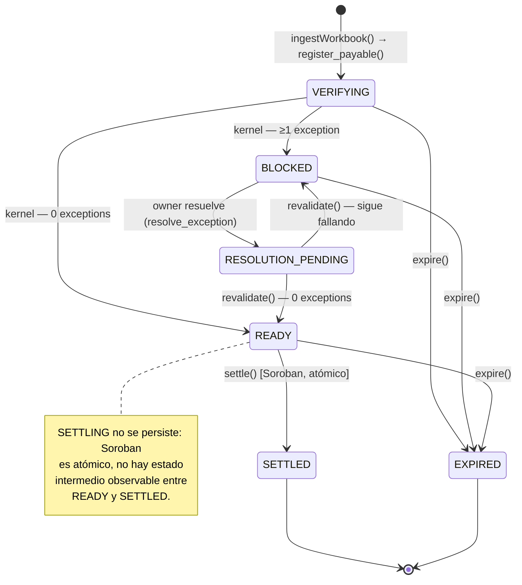
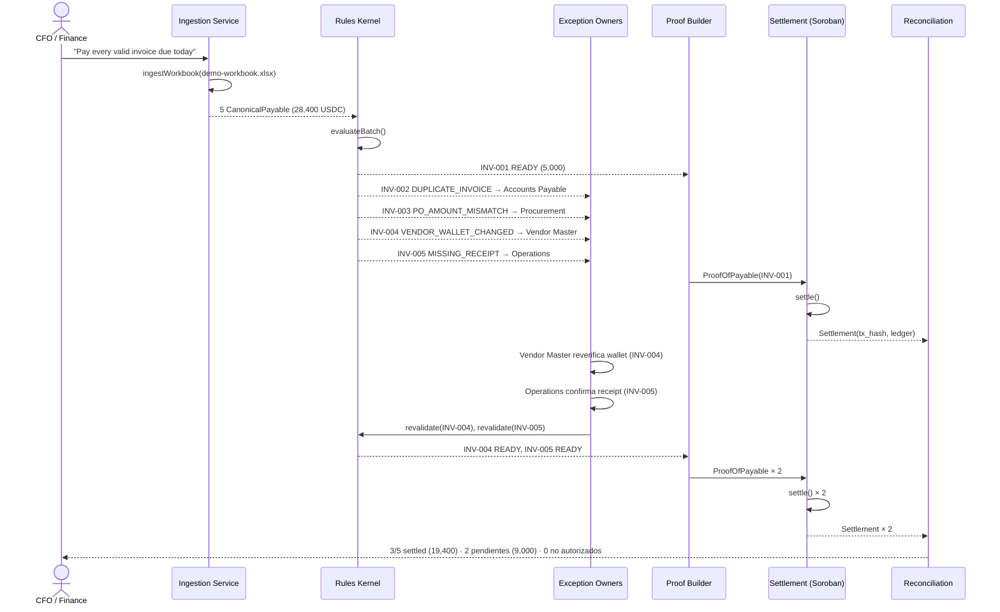
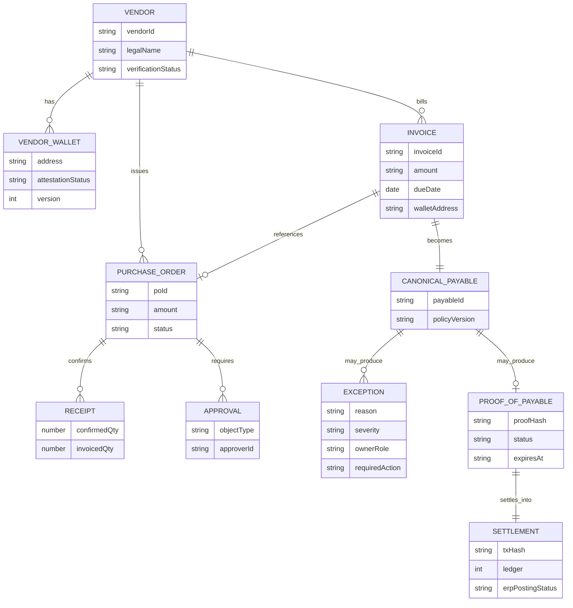

# Pakta — Arquitectura y Flujo Técnico

**Checkpoint intermedio — hackathon**
**Fecha:** 23 de septiembre de 2026
**Repositorio:** https://github.com/devmondoss/pakta

> Esquema y flujo de lo que estamos construyendo: pipeline end-to-end, máquina de estados del payable, secuencia del demo canónico, modelo de datos y stack. Referencia completa: [`product/Pakta_Documento_Maestro.md`](../product/Pakta_Documento_Maestro.md) · [`implementation/Pakta_Plan_Implementacion.md`](Pakta_Plan_Implementacion.md) · [`implementation/Pakta_Division_Trabajo.md`](Pakta_Division_Trabajo.md).

---

## 1. Pipeline end-to-end

De la evidencia cruda (Excel, PDF, email) a un settlement verificable en Stellar y de vuelta a reconciliation. Los subgrafos marcan quién construye cada bloque (ver `Pakta_Division_Trabajo.md`).


---

## 2. Máquina de estados del `Payable`

Un único state machine, coherente entre lo que corre en `@pakta/rules-kernel` (off-chain) y lo que va a aplicar el contrato Soroban (on-chain, capa de Dev 1).



---

## 3. Secuencia del demo canónico (5 invoices, `fixtures/demo-workbook`)

Corrida real contra el fixture ya implementado — no es hipotética, es el test de aceptación `demo-fixture.test.ts` (45/45 tests en verde a la fecha de este checkpoint).



---

## 4. Modelo de datos — Canonical Payable Model

Implementado en `@pakta/canonical-model` (Zod, en `packages/canonical-model/src/schemas.ts`, `exception.ts`, `proof.ts`).



`ProofOfPayable` y `Settlement` son el **único contrato compartido** entre Dev 1 y Dev 2 (`Pakta_Division_Trabajo.md` §5) — viven en `@pakta/canonical-model` para que nadie los reinvente de un lado u otro.

---

## 5. Stack técnico

| Capa | Tecnología | Estado |
|---|---|---|
| Modelo de datos compartido | TypeScript + Zod 4.6.5 (`@pakta/canonical-model`) | ✅ Construido |
| Ingestion (Excel/CSV → Canonical Payable Model) | ExcelJS 4.4.0 (`@pakta/ingestion`) | ✅ Construido |
| Deterministic Control Kernel | TypeScript puro, decimal.js (`@pakta/rules-kernel`) | ✅ Construido — 8 reglas de §7.3 |
| Policy config | YAML (`js-yaml`) validado con Zod en el borde | ✅ Construido |
| AI Extraction Service | Claude (structured output / tool use) | ⏳ Semana 2 |
| Exception Service (routing/notificaciones) | Fastify + BullMQ (planeado) | ⏳ Semana 2 |
| Proof-of-Payable Builder | TypeScript (`@pakta/canonical-model` types) | ⏳ Semana 3 |
| Smart contract | Soroban / Rust (`contracts/payable-contract`) | ⏳ Dev 1 — no iniciado en este checkpoint |
| Settlement | Stellar SDK + Stellar CLI, USDC/SAC, testnet | ⏳ Dev 1 |
| Event Indexer | Stellar RPC `getEvents` | ⏳ Dev 1 |
| Base de datos | PostgreSQL (Supabase) | ⏳ Semana 2 |
| Runtime / tooling | Node 24, pnpm 12.6.0 (workspaces), TypeScript 7.0.2, Vitest 5.0.1 | ✅ Configurado |
| Frontend / dashboard | Next.js + React (mockup ya prototipado, pendiente de conectar a datos reales) | 🎨 Mockup listo |

---

## 6. Estado actual del repo (este checkpoint)

```text
pakta/
├── docs/                         # tesis de producto, plan, división de trabajo
├── packages/
│   ├── canonical-model/          # ✅ schemas Zod + contrato ProofOfPayable/Settlement
│   ├── ingestion/                # ✅ ingestWorkbook() — xlsx/csv → Canonical Payable Model
│   └── rules-kernel/             # ✅ evaluatePayable/evaluateBatch — 8 reglas + reason codes
├── fixtures/demo-workbook/       # ✅ dataset canónico de 5 invoices (28,400 USDC)
├── contracts/                    # ⏳ payable-contract (Soroban) — pendiente, Dev 1
└── apps/                         # ⏳ api (Fastify) + web (dashboard) — pendiente
```

**Resultado verificable hoy:** correr el fixture canónico de 5 invoices produce, de forma determinística, **1 payable READY + 4 BLOCKED** con el `reason_code`/`owner_role`/`required_action` exactos del documento maestro — 45/45 tests en verde, typecheck limpio.

```bash
pnpm install
pnpm test        # 45/45 passed
pnpm typecheck    # clean
```

---

## 7. Próximo paso

Dev 1 arranca `contracts/payable-contract` (Soroban): estado mínimo del `Payable`, los 7 entry points (`register_payable`, `submit_proof`, `block_payable`, `resolve_exception`, `revalidate`, `settle`, `expire`) y los invariantes de no-doble-settlement / no-sustitución de recipient-amount. Deploy de un esqueleto a testnet como primer hito verificable.
