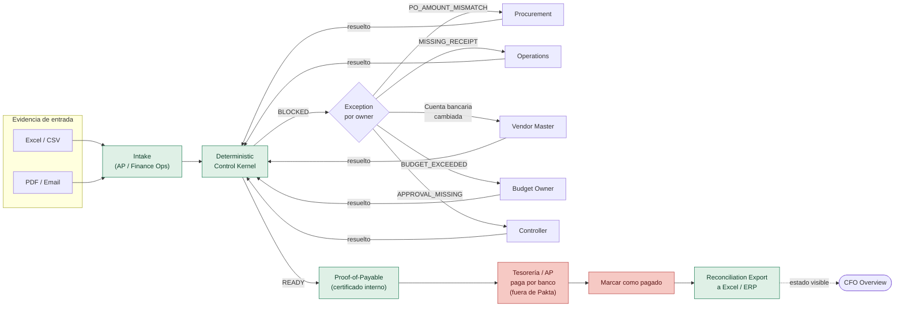
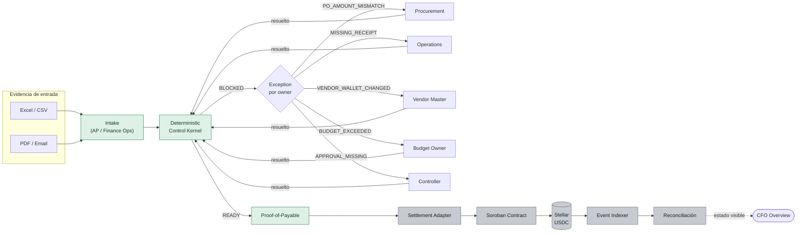

# Pakta — Escenarios corporativos y mapa de pantallas por rol

**Fecha:** 25 de septiembre de 2026
**Origen:** conversación de rediseño de interfaces, a partir de un caso real reportado por un colega que trabaja en el área contable de un corporativo — el proceso hoy es 100% manual (correo, PDFs, Excel) y la pregunta de fondo era si Pakta encaja "perfecto" para una empresa que quiere pasar sus pagos de fiat a crypto.
**Referencia:** complementa `Pakta_Documento_Maestro.md` §4.2, §11.4, §21.2, §22.5 y `Pakta_Arquitectura_Flujo.md` §10 (flujo de usuario por actor). No repite la tesis de producto, solo aterriza los escenarios de adopción en términos de qué pantalla usa cada rol.

---

## 1. Conclusión de la conversación previa (por qué existe este doc)

Pakta **no es una herramienta de migración fiat → crypto**. Es una capa de control/verificación que resuelve el mismo dolor (facturas duplicadas, PO mismatch, receipts faltantes, cambios de cuenta/wallet de proveedor, reconciliación manual) sin importar el rail de settlement final. El caso descrito por el colega — área contable puramente manual — es exactamente el **Nivel 0 (spreadsheet-first)** de la progresión de integración del documento maestro, y encaja perfecto **como capa de control**, independientemente de si la empresa termina pagando en USDC/Stellar o sigue pagando por transferencia bancaria tradicional.

De ahí salen dos escenarios distintos de UI/UX que hay que diseñar por separado, porque cambian las pantallas de Vendors/Wallets y de Settlement:

- **Escenario A** — empresa que NO quiere/necesita crypto: Pakta termina en el Proof-of-Payable como certificado interno; el pago real lo sigue ejecutando el banco/tesorería fuera de Pakta.
- **Escenario B** — empresa que ya paga (o quiere empezar a pagar) proveedores en USDC/stablecoins: es el demo actual, con settlement real en Stellar/Soroban.

---

## 2. Escenario A — "Nivel 0 puro contable" (sin crypto)

Pakta actúa **solo como capa de control y verificación**. No hay wallet, no hay Soroban, no hay settlement on-chain. El dinero sigue moviéndose por el rail que la empresa ya usa (SPEI, wire, banca tradicional); Pakta decide *si* está listo para pagarse y deja un rastro auditable, pero no ejecuta el pago.

| Rol                                  | Qué hace                                                                                                        | Pantalla                                           | Diferencia vs. escenario B                                                                                                                                 |
| ------------------------------------ | --------------------------------------------------------------------------------------------------------------- | -------------------------------------------------- | ---------------------------------------------------------------------------------------------------------------------------------------------------------- |
| **AP / Finance Ops**                 | Carga Excel/PDF/email, resuelve duplicados y proofs vencidos                                                    | Intake, Payables                                   | Igual                                                                                                                                                      |
| **Procurement**                      | Resuelve descalces de monto contra la PO                                                                        | Exceptions                                         | Igual                                                                                                                                                      |
| **Operations / Requester**           | Confirma que la mercadería/servicio llegó                                                                       | Exceptions                                         | Igual                                                                                                                                                      |
| **Vendor Master**                    | Atestigua y reverifica **datos bancarios** del proveedor (no wallet)                                            | Vendors & Payment Details                          | Se renombra de "Wallets" a "Payment Details"; la atestación es de cuenta CLABE/IBAN/SWIFT, no de address Stellar                                           |
| **Budget Owner**                     | Aprueba cuando se excede presupuesto                                                                            | Exceptions                                         | Igual                                                                                                                                                      |
| **Controller**                       | Aprueba pagos grandes (doble aprobación), define policy                                                         | Policy, Exceptions                                 | Igual                                                                                                                                                      |
| **Accounting**                       | Reconciliación cuando falla el posting al ERP                                                                   | (fuera de scope actual)                            | Igual                                                                                                                                                      |
| **Tesorería / AP (ejecuta el pago)** | Una vez `READY`, genera la orden de pago bancaria a mano o vía el ERP, usando el Proof-of-Payable como respaldo | **Proof-of-Payable viewer + "Marcar como pagado"** | Reemplaza la pantalla de Settlement: no hay `settle()` automático, hay un botón manual que registra que el pago salió por el rail externo y cierra el loop |
| **CFO / Head of Finance Ops**        | Solo mira el estado global                                                                                      | Overview                                           | Igual                                                                                                                                                      |
| **Vendor (externo)**                 | No opera Pakta                                                                                                  | Ninguna (Fase 2)                                   | Igual                                                                                                                                                      |

**Pantallas que cambian de fondo respecto al demo actual:**

1. **Vendors & Payment Details** — el campo `wallet_address` se sustituye o convive con cuenta bancaria; la "atestación" sigue siendo el mismo concepto (confirmar que el destino de pago es legítimo antes de soltar el `READY`), pero el dato es bancario, no cripto.
2. **No existe pantalla de Settlement/Reconciliación on-chain.** En su lugar: el Proof-of-Payable se muestra como un certificado interno ("esta obligación cumple todas las condiciones, lista para pagarse") y hay una acción manual de cierre ("Marcar como pagado" + adjuntar comprobante bancario), que alimenta el mismo **Reconciliation Export** hacia Excel/ERP que ya está contemplado en el documento maestro §7.6 y §18.1.
3. El Overview del CFO no muestra "tx en Stellar explorer" — muestra el mismo resumen (`Requested / Ready / Blocked / Settled`) pero "Settled" significa "pagado y reconciliado manualmente", no "tx confirmada on-chain".

---

## 3. Escenario B — "Nivel 0 + settlement Stellar" (el demo actual)

Este es exactamente el mapa ya documentado en `Pakta_Arquitectura_Flujo.md` §10.1, reproducido aquí para tener ambos escenarios lado a lado:

| Rol                           | Qué hace                                                                              | Pantalla                   | `ownerRole` en código |
| ----------------------------- | ------------------------------------------------------------------------------------- | -------------------------- | --------------------- |
| **AP / Finance Ops**          | Carga evidencia, resuelve duplicados y proofs vencidos                                | Intake, Payables           | `AP`                  |
| **Procurement**               | Resuelve descalces de monto contra la PO                                              | Exceptions                 | `PROCUREMENT`         |
| **Operations / Requester**    | Confirma que la mercadería/servicio llegó                                             | Exceptions                 | `OPERATIONS`          |
| **Vendor Master**             | Atestigua y reverifica **wallets Stellar** de proveedores                             | Vendors & Wallets          | `VENDOR_MASTER`       |
| **Budget Owner**              | Aprueba cuando se excede presupuesto                                                  | Exceptions                 | `BUDGET_OWNER`        |
| **Controller**                | Aprueba pagos grandes, define policy                                                  | Policy, Exceptions         | `CONTROLLER`          |
| **Accounting**                | Reconciliación cuando falla el posting al ERP                                         | (fuera de scope de Dev 2)  | `ACCOUNTING`          |
| **Treasury**                  | Ejecuta `settle()` una vez hay Proof-of-Payable, fondea y administra el vault Soroban | Settlement, Reconciliación | — (dominio de Dev 1)  |
| **CFO / Head of Finance Ops** | Solo mira el estado global                                                            | Overview                   | —                     |
| **Vendor (externo)**          | No opera Pakta                                                                        | Ninguna (Fase 2)           | —                     |

**Estado real en código hoy (recordatorio del análisis previo):** no hay auth ni rutas separadas por rol — todo vive en un solo board (`apps/web/src/app/page.tsx`). Solo AP (revalidar) y Vendor Master (wallet actions) y Operations (confirmar receipt) tienen botones de acción reales; Procurement, Budget Owner, Controller y Accounting todavía no tienen acción dedicada en la UI.

---

## 4. Qué comparten ambos escenarios (no cambia con el rail)

- Intake (Excel/CSV/PDF/email) — idéntico.
- Deterministic Control Kernel — las 8 reglas corren igual, no le importa el rail de settlement.
- Exception model (`reason_code` + `owner_role` + `required_action` + `auto_revalidate`) — idéntico.
- El Proof-of-Payable como concepto — en A es un certificado interno de cierre manual; en B es el input que dispara `settle()` on-chain. El *shape* del objeto no cambia, cambia solo qué lo consume después.

## 5. Implicación para el rediseño

El rediseño de interfaces debería tratar **Settlement** como un módulo intercambiable (fiat-manual vs. Stellar-automático) en vez de asumir que siempre hay wallets/Soroban de por medio — igual que el propio backend ya trata el settlement como un "adapter" que decide el rail (SAC / x402 / MPP, documento maestro §7.5, §15). La pantalla de "Vendors & Payment Details/Wallets" es la única que necesita soportar ambos tipos de dato (bancario vs. cripto) desde el diseño de datos, no solo desde el copy.

## 6. Fundamentos de industria (por qué el modelo no es ficticio)

El pipeline y el modelo de exceptions de Pakta no son una invención de hackathon: calcan controles reales de Accounts Payable que ya existen en la industria. Vale la pena citarlos en la demo para que un jurado o un corporativo perciba dominio real del problema, no solo de blockchain.

1. **El "three-way match" del kernel es el proceso estándar de la industria, no una simplificación.** PO → recepción de bienes → invoice, comparando cantidad/precio/monto entre los tres documentos antes de aprobar el pago — es exactamente el flujo que documentan SAP, Oracle, NetSuite y Ramp para AP. Los `reason_code` de Pakta (`PO_AMOUNT_MISMATCH`, `MISSING_RECEIPT`, `DUPLICATE_INVOICE`) son categorías reales de "invoice hold" en esos sistemas, no etiquetas inventadas. ([Bill.com — Three-Way Matching](https://www.bill.com/learning/3-way-matching), [DocuWare — 3-Way Invoice Matching](https://start.docuware.com/blog/document-management/3-way-invoice-matching))
2. **La separación por** `ownerRole` **refleja el conflicto de Segregation of Duties (SoD) más citado en auditoría de AP.** El conflicto crítico #1 en cualquier matriz de SoD de AP es *"vendor master maintenance combinado con payment processing"* — la misma persona no puede cambiar la cuenta/wallet de un proveedor y aprobar el pago hacia esa cuenta. Es exactamente por qué `VENDOR_MASTER` es un rol separado de `AP`/`CONTROLLER` en el modelo de Pakta — se puede presentar como "implementamos el control de SoD #1 que exige auditoría interna", no como decisión arbitraria de datos. ([Ramp — Segregation of Duties in AP](https://ramp.com/blog/accounts-payable/segregation-of-duties-in-accounts-payable), [HighRadius — Segregation of Duties in AP](https://www.highradius.com/resources/Blog/segregation-of-duties-accounts-payable/))
3. `VENDOR_WALLET_CHANGED` **tiene un protocolo real de la industria que hoy Pakta solo simplifica — y que conviene mostrar en la UI como justificación, no solo como fricción.** El control estándar contra fraude de cambio de destino de pago es un **callback**: llamar al proveedor a un número que ya estaba en archivo (nunca al que llegó en el correo/PDF de cambio), confirmar con un contacto conocido, y solo entonces habilitar el cambio. El framework más robusto agrega **doble aprobación** para cualquier cambio bancario/wallet, prohíbe cambios solo-por-email y aplica un **periodo de enfriamiento de 24–48h** antes de activar el destino nuevo. Dato para el pitch: existe un blind spot que ni el callback cubre — un PDF de "carta bancaria" puede ser forjado *después* de creado, y el callback verifica la solicitud, no el archivo adjunto. Esto es un argumento a favor de por qué Pakta necesita **atestación explícita y versionada** (`wallet_attestation_version`) en vez de confiar en el documento adjunto. ([Stampli — Vendor Bank Change Callback Protocol](https://www.stampli.com/resources/vendor-bank-change-callback-protocol/), [DEV Community — Detect the Forged Bank-Letter PDF](https://dev.to/iurii_rogulia/vendor-bank-account-change-fraud-detect-the-forged-bank-letter-pdf-3ild))
4. **Las categorías reales de "invoice exception" en la industria coinciden con las de Pakta, más una que confirma por qué** `owner_role` **es obligatorio.** Los tipos más comunes documentados son: fallas de match contra PO (precio, cantidad, receipt faltante), datos faltantes/inválidos, **"sin owner/approver identificable"**, sospecha de duplicado, y disputas de proveedor. El hecho de que "sin owner identificable" sea uno de los tipos más costosos de resolver en AP real es la validación de por qué toda excepción de Pakta nace con `owner_role` — evita justo ese vacío. ([Stampli — Invoice Exceptions and Holds](https://www.stampli.com/resources/invoice-exceptions-and-holds/), [Hyperbots — Invoice Exception Management 2026](https://blog.hyperbots.com/invoice-exception-management-why-ap-teams-spend-80-of-their-time-on-20-of-invoices))

**Implicación de diseño concreta:** en la pantalla de Vendor Master / Wallet Actions, mostrar el "por qué" del control (ej. un tooltip: *"Los cambios de destino de pago requieren doble aprobación y periodo de espera — estándar de industria contra fraude de proveedor, no una fricción de Pakta"*) comunica dominio real del problema en la demo.

---

## 7. Preguntas abiertas para seguir

- ¿El primer rediseño debería asumir Escenario A (más realista para el corporativo del colega) o seguir con B (lo que ya está construido y demostrado)?
- ¿Vendors & Payment Details necesita soportar los dos tipos de destino a la vez (empresa híbrida: unos proveedores en banca, otros en USDC) o alcanza con uno solo por ahora?
- ¿Quién diseña el "Marcar como pagado" manual del Escenario A — cuenta como una historia nueva de Dev 2 (no está en ningún sprint actual)?
