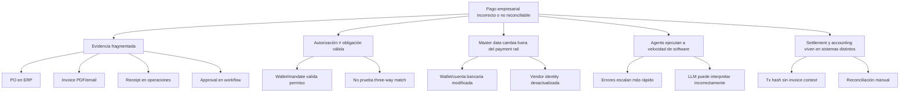
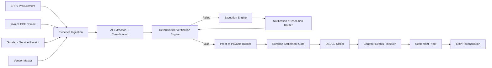
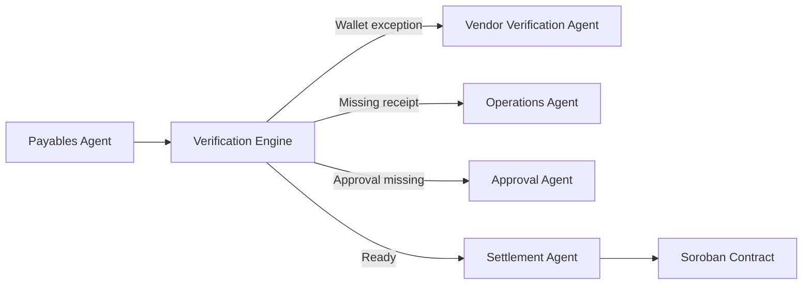
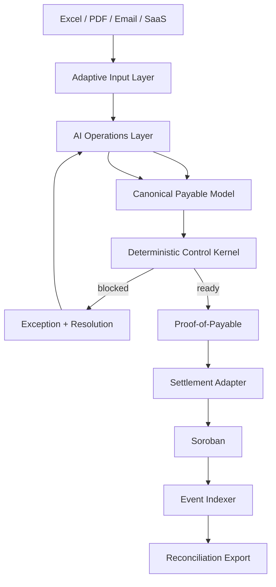

# Pakta
## Enterprise-Grade Agentic Payments Infrastructure for SMEs

**Documento maestro — v1.0**  
**Fecha:** 23 de septiembre de 2026  
**Estado:** tesis de producto consolidada / arquitectura para MVP, validación comercial y hackathon

> **Tesis:** las SMEs sufren los mismos problemas de Accounts Payable, control y reconciliation que una gran empresa, pero normalmente no pueden desplegar la misma infraestructura de SAP/AWS/Bitwave. Pakta se integra con cómo ya trabajan —Excel/CSV, PDFs, email, sistemas contables y APIs—, usa AI agents para interpretar y orquestar trabajo, aplica controles determinísticos antes del dinero y convierte una obligación válida en un **Proof-of-Payable** que habilita agentic stablecoin settlement sobre Stellar.

> **Tagline:** **Enterprise financial infrastructure, without enterprise complexity.**

---

## 1. Resumen ejecutivo

Pakta es una infraestructura de **agentic financial operations y pre-settlement control para SMEs**. Su tesis comercial es sencilla: una empresa pequeña puede tener los mismos problemas de facturas, órdenes de compra, recepciones, cambios de datos del proveedor, aprobaciones, pagos duplicados y conciliación que una corporación; lo que no tiene es un equipo de integración ni un stack enterprise para resolverlos. En 2025, IFOL reportó que 63% de los equipos encuestados dedicaba más de 10 horas semanales al procesamiento de invoices y 66% todavía ingresaba datos manualmente al ERP. El problema no es marginal: la automatización existe, pero su adopción práctica sigue fragmentada.

Pakta no obliga a la SME a empezar con SAP ni a reconstruir su operación. Puede comenzar con **Excel/CSV + PDFs + email** y progresar hacia QuickBooks, Odoo, Zoho, NetSuite, APIs o ERP connectors. La capa de AI interpreta documentos, clasifica evidencia, propone matches, persigue información faltante, genera mensajes, enruta exceptions y reanuda procesos. Sin embargo, la salida de dinero no depende de una opinión probabilística: un **deterministic verification kernel** valida las condiciones empresariales que realmente autorizan el payable.

La distinción central es:

- El payment rail responde **“¿podemos mover el dinero?”**.
- El agent mandate/wallet responde **“¿el agent está autorizado a actuar?”**.
- Pakta responde **“¿esta obligación empresarial específica está realmente lista para pagarse, a este recipient, por este amount, ahora?”**.

Cuando las condiciones se cumplen, Pakta emite un **Proof-of-Payable** y habilita settlement en Stellar —por ejemplo mediante USDC/SAC—. Cuando no se cumplen, no devuelve un simple error: crea una **typed exception** con `reason_code`, owner, evidencia faltante y acción requerida. Después de la corrección, revalida y continúa el flujo. Finalmente liga el settlement con el payable original para reconciliation y auditability.

La propuesta no es construir otro ERP ni competir feature por feature con AWS o Bitwave. AWS documenta una arquitectura agentic para P2P exceptions basada en AgentCore, Cognito, MCP Gateway, Lambda, Bedrock Knowledge Base, Aurora/S3, DynamoDB, SNS y SAP/ERP. Bitwave ya ofrece vendor wallet verification, allowlists, stablecoin AP, ERP sync, reconciliation, accounting y agentic interfaces. Pakta busca otra cuña: **la misma disciplina de control y automatización, pero con una superficie de integración mucho menor, progressive onboarding y una UX pensada para empresas que todavía operan financieramente desde spreadsheets y documentos**.

### 1.1 Producto en una línea

> **Pakta convierte el flujo financiero real de una SME en un proceso agentic verificable: entiende la evidencia, resuelve exceptions y permite que el dinero se mueva únicamente cuando el payable es válido.**

### 1.2 Pipeline resumido

```text
Excel / CSV / PDF / Email / Accounting App
                    ↓
              AI INGESTION
 extract · classify · match · request missing evidence
                    ↓
         DETERMINISTIC VERIFICATION
 PO · invoice · receipt · vendor · wallet · approvals · policy
              ↙                 ↘
       EXCEPTION              READY
 reason + owner                 ↓
 notify + resolve        Proof-of-Payable
       ↓                         ↓
    revalidate           Stellar / USDC
              ↘                 ↓
               SETTLEMENT PROOF
                      ↓
              Reconciliation
```

### 1.3 Qué es Pakta y qué no es

**Pakta es:** adaptive ingestion + AI orchestration + deterministic controls + exception resolution + verifiable settlement + reconciliation bridge.

**Pakta no es:** otro ERP, un LLM con acceso libre al treasury, un custodio de claves privadas, un replacement de x402/MPP, un nuevo accounting ledger completo ni un requisito para guardar documentos empresariales on-chain.

### 1.4 Índice del documento maestro

1. Resumen ejecutivo y posicionamiento SME  
2. Problema y desacople entre business validity y payment authorization  
3. Causa raíz  
4. Pain points, evidencia y realidad operativa de las SMEs  
5. Caso `VENDOR_WALLET_CHANGED`  
6. Producto: Proof-of-Payable, exceptions y reconciliation  
7. Pipeline end-to-end y progressive integration  
8. Papel de Stellar  
9. AI/Agents: automatización útil y límites  
10. Exception model  
11. Stakeholders y buyer  
12. Sovereign Control  
13. Data architecture y privacidad  
14. Threat model  
15. Relación con AP2, x402, MPP y wallets  
16. Landscape, AWS/Bitwave y diferenciación  
17. Proof of Value  
18. MVP técnico Excel-first  
19. Smart contract design  
20. Business model  
21. Opportunity / go-to-market  
22. Riesgos y objeciones  
23. Validación comercial / kill criteria  
24. Roadmap  
25. Demo  
26. Pitch / thesis final  
27. Referencias  
28. Definición final

---

## 2. El problema

### 2.1 El payment rail conoce la transacción; la empresa conoce la obligación

Una transacción en Stellar puede demostrar con enorme precisión:

- quién firmó;
- qué cuenta autorizó una acción;
- qué asset se movió;
- cuál fue el monto;
- cuál fue el recipient;
- cuándo se confirmó;
- qué contract ejecutó la lógica.

Pero esos datos no demuestran por sí solos:

- que la invoice corresponde a una compra aprobada;
- que los bienes o servicios fueron recibidos;
- que el monto coincide con el PO o con una tolerancia aprobada;
- que la invoice no fue pagada previamente;
- que la wallet pertenece realmente al supplier esperado;
- que el centro de costo es correcto;
- que las aprobaciones empresariales requeridas están completas;
- que una modificación posterior del supplier master fue válida;
- que la obligación sigue vigente al momento exacto del settlement.

Este es el desacople central entre **financial authorization** y **business validity**.

### 2.2 “Puede pagar” no equivale a “debe pagar”

Un agent wallet puede tener:

- un daily spending limit;
- whitelist de merchants;
- session keys;
- human approval por encima de cierto monto;
- idempotency keys;
- un Payment Mandate;
- una firma perfectamente válida.

Aun así puede ejecutar una operación empresarial incorrecta.

Ejemplo:

```text
Agent budget:              10,000 USDC    ✓
Merchant allowed:          CloudData      ✓
Invoice amount:             5,000 USDC    ✓
Agent signature:                 valid    ✓

Registered supplier wallet:    GA123...
Invoice asks to pay:            GB982...

Business validity:                FAIL
```

Desde la perspectiva del rail, el pago podría ser técnicamente correcto. Desde la perspectiva de Treasury, puede ser una pérdida irreversible.

### 2.3 Por qué los agents agravan el problema

La automatización tradicional normalmente ejecutaba reglas estrechas. Un AI agent puede leer documentos, inferir correspondencias, navegar sistemas, solicitar aprobaciones, negociar con otros agents y disparar herramientas. Ese poder aumenta la eficiencia, pero también amplía la superficie de error.

Deloitte reportó en 2026 que aproximadamente el 80% de las organizaciones encuestadas aún no contaba con capacidades maduras de gobernanza para agentic AI, incluyendo límites claros de autonomía, monitoring y audit trails. PwC y OpenAI, al mismo tiempo, están desplegando agents en procurement, payments, treasury y accounting. El punto no es que la IA sea insegura por definición, sino que **la organización está delegando acciones financieras más rápido de lo que madura su capa de control**.

**Causa estructural:** el agent entiende contexto probabilísticamente; el dinero necesita condiciones deterministas y atribuibles.

---

## 3. Causa raíz

La causa raíz no es “las facturas tienen errores”. Tampoco es “blockchain no tiene metadata”. Es una combinación de fragmentación de evidencia, separación entre sistemas y delegación de autoridad.

### 3.1 Root cause tree



### 3.2 Five Whys simplificado

**¿Por qué se ejecutó un pago incorrecto?** Porque el mecanismo de settlement recibió una instrucción válida.  
**¿Por qué la instrucción válida era empresarialmente incorrecta?** Porque su autorización no estaba ligada a toda la evidencia del payable.  
**¿Por qué no estaba ligada?** Porque PO, invoice, receipt, supplier master, approvals y payment rail viven en sistemas diferentes.  
**¿Por qué un agent no puede simplemente leerlos y decidir?** Porque interpretación y autorización no deben confundirse: un LLM puede proponer, pero no debe ser la raíz final de autoridad sobre fondos.  
**¿Qué falta entonces?** Un artefacto verificable y revalidable que convierta evidencia empresarial dispersa en una condición explícita de settlement.

Ese artefacto es el **Proof-of-Payable**.

---

## 4. Pain points, causas y efectos

| Pain point | Causa inmediata | Efecto operativo | Riesgo / costo | Principal afectado |
|---|---|---|---|---|
| Invoice sin receipt | Servicio/bien aún no confirmado | Hold y persecución manual | Pago anticipado o retraso | AP, Operations, supplier |
| Invoice > PO | Error, cambio de precio o amendment pendiente | Exception / approval | Overpayment o retraso | Procurement, AP |
| Invoice duplicada | Reenvío, OCR, múltiples canales | Revisión manual | Double payment | Finance |
| Wallet cambiada | Supplier actualiza destino o impostor lo suplanta | Revalidación de payee | Pérdida irreversible | Treasury, Vendor Master |
| Supplier incorrecto | Master data o matching incorrecto | Pago bloqueado / corregido | Fraud/error | AP, Risk |
| Receipt parcial | Delivery incompleto | No está claro cuánto pagar | Disputa / leakage | AP, Requester |
| Approval faltante | Workflow incompleto | Hold | Policy breach | Controller |
| Cost center equivocado | Clasificación incorrecta | Journal correction | Mala contabilidad | Accounting |
| Settlement sin business reference | Tx aislada del ERP | Reconciliation manual | Cierre lento, errores | Accounting |
| Agent autorizado pero decisión equivocada | Spending guardrail insuficiente | Ejecución automática incorrecta | Pérdida acelerada | CFO / Risk |

### 4.1 Evidencia de que el problema ya existe

Los sistemas enterprise dedican infraestructura explícita a estas excepciones:

- SAP Concur permite three-way matching entre invoice, PO y received quantities y genera exceptions cuando hay discrepancias.
- SAP también dispone de reglas de duplicate invoice detection.
- Oracle Payables utiliza invoice holds que pueden impedir el pago hasta resolver condiciones determinadas.
- Oracle permite someter cambios del supplier profile, incluyendo bank accounts, a change control y approval workflows.
- AFP reportó que 79% de organizaciones encuestadas sufrieron intentos o incidentes de payment fraud durante 2024; BEC fue citado por 63%, y vendor imposter fraud por 45% en su comunicado de 2025.

Pakta no necesita demostrar que invoice exceptions son nuevas. Necesita demostrar que **la transición hacia agents + stablecoin settlement crea una nueva necesidad de control interoperable antes de mover fondos**.

### 4.2 La realidad SME: mismo dolor, menos infraestructura

El wedge de Pakta no parte de asumir que una SME tiene problemas distintos a una enterprise. Parte de lo contrario: **tiene problemas parecidos, pero menos tooling, menos especialización y menos presupuesto de integración**.

Una operación pequeña puede repartir funciones que en una gran empresa están separadas entre AP, Procurement, Treasury, Vendor Master y Controller dentro de dos o tres personas. La información también suele estar dispersa en formatos cotidianos:

```text
Excel / Google Sheets
PDF invoices
email threads
WhatsApp exports o mensajes reenviados
accounting software
bank / wallet exports
shared folders
```

El research de IFOL de 2025 refuerza esta brecha operativa: 63% de los encuestados dedicaba más de diez horas semanales a invoice processing y 66% aún hacía manual invoice data entry en sus ERP. Eso no prueba por sí solo un mercado para Pakta, pero sí demuestra que **la automatización disponible no ha eliminado el trabajo manual básico**.

La estrategia de Pakta es reducir el costo de entrada mediante **progressive integration**:

1. **Level 0 - Spreadsheet-first:** Excel/CSV + documentos + wallet.
2. **Level 1 - SaaS connectors:** email, Drive, QuickBooks/Odoo/Zoho u otros sistemas accesibles a SMEs.
3. **Level 2 - API/ERP:** NetSuite y plataformas más estructuradas.
4. **Level 3 - Enterprise:** SAP/Oracle/custom procurement, si el cliente crece o el partner lo requiere.

La promesa comercial es que el control se pueda sofisticar sin obligar a la empresa a migrar toda su operación desde el primer día.

---

## 5. Caso emblemático: Vendor Wallet Changed

Este caso resume la tesis porque separa con claridad autorización técnica de validez empresarial.

### 5.1 Estado inicial

```text
Supplier:               CloudData Inc.
PO:                      PO-72881
Invoice:                 INV-9872
Amount:                  5,000 USDC
Receipt:                 100% delivered
Registered wallet:       GA123...
```

Three-way match:

```text
PO ↔ Invoice       ✓
Invoice ↔ Receipt  ✓
Amount             ✓
Supplier           ✓
```

### 5.2 Cambio de destino

Llega un mensaje:

> “We updated our Stellar address. Please send future payments to GB982...”

La invoice puede seguir siendo legítima. El supplier puede ser correcto. El amount puede ser exacto. El agent incluso puede tener permiso para gastar 10,000 USDC.

Pero la relación:

```text
CloudData Inc. ↔ GB982...
```

aún no está probada.

### 5.3 Comportamiento de Pakta

```text
Invoice                         ✓
PO                              ✓
Receipt                         ✓
Amount                          ✓
Budget                          ✓
Agent mandate                   ✓
Vendor wallet attestation       ✗

STATUS: BLOCKED
REASON: VENDOR_WALLET_CHANGED
OWNER: Vendor Master / Treasury
REQUIRED ACTION: Reverify wallet ownership
```

El punto más importante es que **BLOCKED no es un estado terminal**.

Pakta crea una exception con:

- reason code;
- severity;
- payable_id;
- evidencia que falló;
- actor responsable;
- acción necesaria;
- expiration/review deadline;
- mecanismo de revalidation.

Cuando la nueva wallet se verifica y la modificación es aprobada:

```text
VENDOR_WALLET_CHANGED
        ↓
REVERIFYING
        ↓
ATTESTATION UPDATED
        ↓
REVALIDATING PAYABLE
        ↓
READY
        ↓
SETTLED
```

Esta semántica de resolución es central: Pakta no es solamente un “fraud blocker”; es un **exception orchestration layer**.

---

## 6. Qué construye Pakta

Pakta tiene tres funciones principales.

### 6.1 Proof-of-Payable

Un objeto verificable que expresa:

> Para este payable, la evidencia requerida por la policy vigente fue validada, el recipient fue vinculado al supplier esperado, las aprobaciones requeridas existen y el payable puede liquidarse dentro de una ventana y monto determinados.

Ejemplo conceptual:

```json
{
  "payable_id": "PAY-2026-9182",
  "invoice_hash": "0x...",
  "po_hash": "0x...",
  "receipt_hash": "0x...",
  "vendor_id": "VEN-819",
  "vendor_wallet": "GABC...",
  "wallet_attestation_version": 7,
  "amount": "8430.00",
  "asset": "USDC",
  "policy_version": "FIN-4.2",
  "approvals_hash": "0x...",
  "cost_center": "INFRA-042",
  "expires_at": "2026-09-25T18:00:00Z",
  "status": "READY"
}
```

Para el vault del MVP, este payload se canonicaliza con JCS y se calcula `proof_hash = SHA-256(JCS(payload))`. El envoltorio firmado añade `proof_hash`, `issuer_public_key`, `issuer_signature`, `network_passphrase` y `contract_id`; la firma cubre un digest de registro que también vincula recipient, SAC, monto, policy, vencimiento e ID del payable. El schema compartido implementado aún está en v1.0; la edición v1.1 se coordina entre Dev 1 y Dev 2 según `Pakta_Division_Trabajo.md` §7.

### 6.2 Exception Orchestration

Si una regla falla, Pakta produce un objeto accionable y machine-readable.

```json
{
  "payable_id": "PAY-2026-9182",
  "status": "BLOCKED",
  "reason": "VENDOR_WALLET_CHANGED",
  "severity": "CRITICAL",
  "owner_role": "VENDOR_MASTER",
  "required_action": "REVERIFY_VENDOR_WALLET",
  "auto_revalidate": true
}
```

### 6.3 Settlement Proof + Reconciliation

Después del pago, Pakta liga el settlement con la obligación:

```json
{
  "payable_id": "PAY-2026-9182",
  "invoice_id": "INV-2817",
  "po_id": "PO-1829",
  "settlement": {
    "network": "stellar",
    "asset": "USDC",
    "amount": "8430.00",
    "tx_hash": "abx932...",
    "ledger": 12345678
  },
  "status": "SETTLED",
  "erp_posting_status": "RECONCILED"
}
```

La blockchain demuestra que el dinero se movió. Pakta demuestra **qué payable empresarial justificó y extinguió ese movimiento**.

---

## 7. Pipeline end-to-end

### 7.0 Progressive integration: Pakta se adapta a cómo ya trabaja la empresa

La primera versión no exige un ERP. Cada fuente se convierte a un **Canonical Payable Model** común. Un workbook de Excel puede actuar como mock database realista para una SME:

```text
VENDORS   → vendor_id, legal_name, payment_wallet, verification_status
PO        → po_id, vendor_id, amount, status, approver
INVOICES  → invoice_id, po_id, vendor_id, amount, due_date, wallet
RECEIPTS  → po_id, received_qty/status, confirmed_by
APPROVALS → object_id, policy, approver, timestamp
PAKTA     → status, reason_code, owner, action, tx_hash
```

Cuando una empresa madura, el mismo canonical model puede alimentarse por API. De esta forma la lógica de control no depende de que el cliente tenga un stack enterprise.



### 7.1 Paso 1 — Evidence ingestion

Pakta no exige que toda la empresa migre sus datos. Consume la evidencia de donde ya existe:

- ERP APIs;
- procurement platform;
- supplier portal;
- invoice email inbox;
- PDF/document store;
- warehouse/service receipt system;
- vendor master;
- approval service;
- budget/accounting system.

### 7.2 Paso 2 — AI extraction

AI/agents pueden:

- extraer supplier, invoice number, amount, currency, PO reference y payment instructions;
- clasificar el documento;
- proponer una relación invoice ↔ PO;
- detectar que un correo solicita un cambio de wallet;
- resumir una exception para humanos;
- contactar al owner correcto o disparar un A2A workflow.

Pero la salida del modelo debe ser tratada como **evidence proposal**, no como autorización financiera final.

### 7.3 Paso 3 — Deterministic verification

El motor aplica rules versionadas, por ejemplo:

```text
invoice.vendor_id == po.vendor_id
invoice.amount <= po.remaining_amount + tolerance
receipt.confirmed_quantity >= invoiced_quantity
invoice_fingerprint NOT IN settled_invoices
vendor_wallet == active_attested_wallet
approval_threshold_satisfied == true
budget_available >= amount
payable.expiry > now
```

Una regla puede estar respaldada por:

- datos firmados;
- hashes de documentos;
- ERP source-of-truth;
- attestations;
- human approvals;
- contract state.

### 7.4 Paso 4 — Proof or Exception

Si todas las condiciones pasan, se emite un Proof-of-Payable. Si alguna condición falla, se crea una exception. Las exceptions deben ser revalidables; no basta con notificar.

### 7.5 Paso 5 — Settlement

El settlement adapter decide qué rail usar:

- **SAC transfer** para supplier invoices y payouts normales;
- **x402** cuando el payable es un request de un servicio/API;
- **MPP** cuando existe una sesión de micropagos frecuentes.

### 7.6 Paso 6 — Reconciliation

Los contract events y el tx hash se capturan y se asocian al payable original. Pakta actualiza el ERP o expone un posting/reconciliation event.

---

## 8. Dónde entra Stellar

Stellar no debe entrar como decoración. Debe resolver funciones concretas.

### 8.1 Soroban como Settlement Gate

Soroban puede mantener una state machine mínima y aplicar authorization antes de mover activos.

Estados sugeridos:

```text
DRAFT
  ↓
VERIFYING
  ├──→ BLOCKED → RESOLUTION_PENDING → REVALIDATING ──┐
  │                                                  │
  └──→ READY ←───────────────────────────────────────┘
          ↓
      SETTLING
          ↓
       SETTLED

Alternativos: REJECTED / EXPIRED / CANCELLED
```

Funciones conceptuales del MVP; `resolve_exception` y `revalidate` siguen en el kernel fuera de cadena:

```text
initialize()
register_payable()        // proof READY firmado por issuer
revoke_payable()          // invalida un proof registrado
settle(payable_id)        // auth del executor; mueve saldo del vault
expire()
attest_lifecycle()        // eventos; no cambia el gate de pago
set_limits() / set_paused() / withdraw()  // admin de Treasury
```

El contract no necesita guardar todos los documentos. Debe almacenar solo el estado y commitments esenciales.

### 8.2 Stellar Asset Contract (SAC)

El SAC permite a contracts interactuar con assets de Stellar. Para el MVP, un payable READY puede terminar en un `transfer` de USDC testnet/mainnet según el entorno.

### 8.3 Soroban Authorization

La autorización permite expresar qué addresses pueden ejecutar operaciones. Pakta puede separar roles:

- proof issuer;
- finance approver;
- settlement executor;
- emergency pauser;
- treasury contract.

### 8.4 Contract Accounts y Sovereign Control

En el MVP, Treasury conserva sus claves pero prefondea un vault Soroban: el contrato **custodia el saldo depositado** y paga desde su balance, con caps por payable y ventana. Treasury administra límites, pausa y retiros. Una contract account/smart account con políticas propias (SEP-45) es una evolución posterior para evitar esta custodia.

### 8.5 Contract Events

Los events proporcionan una interfaz natural para audit, indexing y reconciliation:

```text
payable_registered
payable_blocked
exception_resolved
payable_ready
settlement_executed
payable_reconciled
```

### 8.6 SEP-10 y SEP-45

SEP-10 prueba control sobre una Stellar account; SEP-45 extiende el patrón a contract accounts. Importante: probar control criptográfico de una address **no equivale** a demostrar que la address pertenece legalmente a un supplier. Esa relación necesita una capa de vendor identity/attestation.

### 8.7 x402 y MPP

Stellar ya soporta payment protocols para agents y machine-to-machine services. Pakta no compite con ellos: define si existe la obligación o policy state que permite utilizar esos rails.

```text
Proof-of-Payable
       ↓
Settlement Adapter
   ├── SAC transfer
   ├── x402
   └── MPP
```

---

## 9. AI y Agents: qué hacen y qué no hacen

### 9.1 Roles adecuados para AI

AI puede ser excelente en:

- document understanding;
- entity extraction;
- fuzzy matching;
- anomaly explanation;
- routing;
- conversational interfaces;
- gathering missing evidence;
- generating an audit narrative;
- coordinating specialized agents.

### 9.2 Lo que AI no debe ser

El LLM no debe ser:

- la private key del treasury;
- la única fuente de verdad de supplier identity;
- el componente que decide arbitrariamente una policy override;
- la raíz final de autorización del settlement;
- quien “imagina” que una invoice coincide cuando una condición determinista no se cumple.

### 9.3 Agent architecture

Una implementación puede separar agentes:



El valor del multi-agent design no está en tener muchos agentes, sino en **separar responsabilidades y mantener el settlement sujeto a un deterministic gate**.

### 9.4 Principio de automatización: usar AI donde reduce fricción

Pakta no adopta la postura de “AI solo para OCR”. Si una tarea consume trabajo humano repetitivo y puede automatizarse con suficiente control, debe evaluarse para agents. Ejemplos:

- leer y estructurar invoices, POs, receipts y contratos;
- descubrir relaciones entre documentos cuando faltan IDs exactos;
- resumir la causa de una exception en lenguaje natural;
- contactar al responsable y solicitar la evidencia precisa;
- interpretar una respuesta del supplier y adjuntar la evidencia recibida;
- priorizar queues según due date, amount y risk;
- reabrir/revalidar automáticamente un payable cuando cambia la evidencia;
- preparar reconciliation narratives y audit packets.

El límite no es “usar poco AI”; el límite es **no convertir al modelo probabilístico en la raíz de autoridad sobre el dinero**. La arquitectura óptima es agentic en operaciones y determinística en los invariants que permiten settlement.

---

## 10. Exception model

Los reason codes pueden convertirse en una interfaz interoperable.

| Code | Meaning | Owner | Resolution |
|---|---|---|---|
| `DUPLICATE_INVOICE` | Invoice ya registrada/pagada | AP | Reject / review |
| `PO_AMOUNT_MISMATCH` | Amount supera PO/tolerance | Procurement | PO amendment / credit note |
| `MISSING_RECEIPT` | No existe confirmación de entrega | Operations | Confirm receipt |
| `PARTIAL_RECEIPT` | Entrega insuficiente | Operations/AP | Partial payment or wait |
| `VENDOR_WALLET_CHANGED` | Wallet difiere de master | Vendor Master/Treasury | Reverify + approve |
| `UNATTESTED_WALLET` | No hay binding supplier↔wallet | Vendor Master | Attestation |
| `BUDGET_EXCEEDED` | Presupuesto insuficiente | Budget Owner | New approval |
| `APPROVAL_MISSING` | Falta quorum/approval | Controller | Approve/reject |
| `PROOF_EXPIRED` | Evidencia/proof vencido | AP | Revalidate |
| `PAYMENT_ALREADY_SETTLED` | Replay/duplicate | AP | Block |
| `ERP_POSTING_FAILED` | Tx confirmó pero posting falló | Accounting | Reconcile manually/retry |

### Propiedades de una buena exception

1. **Deterministic code:** otro sistema debe poder reaccionar sin leer texto libre.  
2. **Human-readable explanation:** un usuario entiende el motivo.  
3. **Owner:** alguien es responsable.  
4. **Required action:** describe qué desbloquea el payable.  
5. **Evidence pointer:** muestra qué source produjo el conflicto.  
6. **Revalidation semantics:** la resolución vuelve automáticamente a verification.  
7. **Auditability:** cada cambio queda versionado.

---

## 11. Stakeholders

### 11.1 Primary stakeholders

| Stakeholder | Dolor | Valor de Pakta |
|---|---|---|
| Accounts Payable | Matching, chasing, exceptions | Auto-validation + exception routing |
| Procurement | PO terms y amendments | Evidence-linked payable controls |
| Requester / Operations | Confirmar receipt | Clear action requests |
| Vendor | No sabe por qué no cobra | Explainable status + faster resolution |
| Vendor Master | Identidad y payment destination | Wallet attestations + change control |
| Treasury | No enviar fondos al recipient equivocado | Pre-settlement gate |
| Controller | Policy y accounting integrity | Deterministic controls |
| CFO / Head of Finance Ops | Delegar sin perder control | Governed agent autonomy |
| Internal Audit | Reconstruir decisiones | Evidence chain + events |
| Risk / Compliance | Fraud y prohibited counterparties | Policy hooks |
| AI Platform Owner | Dar tools financieras a agents | Safe execution boundary |
| ERP / IT | Evitar reemplazos grandes | Integration layer |

### 11.2 Quién usa, quién sufre, quién compra

- **Operational user:** Accounts Payable / Finance Operations.
- **Risk owner:** Treasury, Controller, CFO.
- **Economic buyer:** Head of Finance Operations, Controller, CFO o la plataforma B2B/stablecoin que necesita ofrecer controls a sus clientes.
- **Technical buyer/champion:** Head of Payments, Web3/Blockchain Lead, Enterprise Architecture o FinOps engineering.

### 11.3 Stakeholders en una SME

En una SME, varios roles pueden recaer en la misma persona. El dueño o Finance Lead puede ser simultáneamente budget owner, approver y treasury operator. Pakta no debe exigir segregación organizativa que no existe; debe permitir **policies proporcionales al tamaño** sin perder audit trail. Ejemplo: dos-person approval solo por encima de un threshold, wallet changes siempre con independent confirmation y low-risk invoices con straight-through processing.

### 11.4 Primer cliente ideal

No empezar por una gran corporación que no usa stablecoins. El wedge inicial debería ser alguien que ya tenga el problema de conectar obligaciones empresariales con settlement programable:

- B2B cross-border payment provider;
- contractor/global payroll platform;
- AI/data marketplace;
- stablecoin PSP;
- marketplace que paga múltiples suppliers;
- fintech con corporate treasury flows;
- empresa que ya usa USDC para vendor payouts.

El pitch cambia de “adopta blockchain” a:

> “Ya estás pagando con stablecoins. Pakta evita que tu automation convierta una invoice válida en un settlement empresarial inválido.”

---

## 12. Sovereign Control

“Sovereign control” en Pakta significa que la empresa mantiene control sobre cuatro cosas críticas.

### 12.1 Sovereignty of funds

En el MVP Treasury conserva sus keys y decide cuánto saldo depositar en un vault Soroban. El contrato custodia ese float acotado, aplica límites por payable y por ventana y solo transfiere tras firma válida del issuer y autorización del executor. Treasury puede pausar y retirar saldo no comprometido mediante funciones autorizadas. El sistema no es todavía una arquitectura sin custodia de fondos; esa es la ruta futura con contract account.

### 12.2 Sovereignty of policy

La empresa define:

- amount tolerances;
- approval thresholds;
- allowed assets;
- allowed recipients;
- wallet change process;
- roles;
- expiry;
- emergency pause;
- manual override conditions.

Pakta ejecuta policies versionadas; no inventa policies.

### 12.3 Sovereignty of evidence

Los documentos sensibles pueden permanecer off-chain y dentro del tenant/ERP del cliente. La red necesita commitments/hashes y campos mínimos, no el invoice PDF completo.

### 12.4 Sovereignty of decision

AI propone y coordina. La autoridad real proviene de:

- enterprise data sources;
- explicit approvals;
- attestations;
- deterministic policy;
- cryptographic authorization.

Esto es crucial para vender autonomía sin vender “un bot que controla el treasury”.

---

## 13. Data architecture y privacidad

### 13.1 On-chain vs off-chain

**Off-chain:**

- invoice PDF;
- PO completo;
- tax information;
- supplier legal data;
- contracts;
- delivery evidence;
- personal information;
- business descriptions.

**On-chain / verifiable commitments:**

- payable identifier/hash;
- document hashes;
- policy version/hash;
- recipient address;
- amount/asset (si el settlement lo requiere);
- state;
- approval/attestation commitments;
- timestamps/expiry;
- settlement event.

### 13.2 Why hashes are not magic privacy

Un hash de un documento no hace seguro publicar datos predecibles. El diseño debe evitar commitments triviales susceptibles de dictionary attacks y mantener el contenido sensible fuera de cadena. Para el MVP, hashes sirven principalmente como tamper-evident references; no se debe vender el sistema como “confidential procurement”.

### 13.3 Future privacy

Posibles extensiones futuras:

- confidential tokens/amounts cuando estén suficientemente maduros;
- selective disclosure credentials;
- zero-knowledge proofs de algunas policies;
- private attestations;
- enterprise-controlled encrypted evidence stores.

No son necesarias para probar el MVP.

---

## 14. Threat model

### 14.1 Amenazas principales

1. **Prompt injection en invoice/email.** Un documento intenta instruir al agent a cambiar recipient.  
2. **Vendor impersonation.** Un atacante envía nuevas payment instructions.  
3. **Duplicate invoice.** Mismo payable presentado varias veces.  
4. **Replay de proof.** Un Proof-of-Payable se intenta usar de nuevo.  
5. **Stale proof.** La invoice era válida, pero supplier wallet/policy cambió antes del settlement.  
6. **Compromised agent.** El agent intenta ejecutar fuera de policy.  
7. **Compromised API integration.** Evidence source falsificado.  
8. **ERP posting failure.** Settlement confirmó pero accounting no lo refleja.  
9. **Privilege escalation.** Un usuario/agent intenta autoaprobar excepciones.  
10. **Human override abuse.** Un approver legítimo ignora un control crítico.

### 14.2 Controles

- strict tool boundaries;
- typed outputs;
- signed evidence/attestations donde aplique;
- separation of duties;
- proof expiry;
- `payable_id` único con marcador anti-replay retenido; idempotencia de settlement;
- recipient binding;
- deterministic checks;
- role-based authorization;
- pause/emergency controls;
- event monitoring;
- independent reconciliation.

### 14.3 Revalidation at execution time

`READY` no debe ser eterno. Antes de `settle()`, el adapter comprueba el estado del kernel y el contrato aplica sus propios gates. Si un proof registrado queda obsoleto, el issuer lo revoca on-chain antes de otro intento. Se comprueba que:

- proof no expiró;
- amount/recipient no cambió;
- payable no fue settled;
- policy version sigue permitida;
- wallet attestation sigue activa.

Eso reduce la ventana entre “proof generado” y “money moved”.

---

## 15. Relación con AP2, x402, MPP y wallets

### 15.1 AP2

AP2 trabaja con Intent/Cart/Checkout/Payment Mandates y busca aportar accountability y autorización en agentic commerce. Pakta no debe reinventar mandates. Su frontera es otra: **business obligation evidence** de Accounts Payable.

Simplificando:

```text
AP2:   ¿El usuario/actor autorizó esta compra/pago?
Pakta: ¿La organización tiene una obligación válida y verificable para pagar esto?
```

En el futuro, un Proof-of-Payable puede referenciar o alimentar un Payment Mandate.

### 15.2 x402

x402 resuelve payment gating por request. Pakta podría decidir si el agent está autorizado a aceptar ese payable según policy, pero no necesita sustituir x402.

### 15.3 MPP

MPP sirve para machine payments, incluyendo high-frequency sessions. Pakta puede ser la capa de policy/business validity que determina qué sesión o spend está permitido.

### 15.4 Agent wallets

Wallets con spending limits, human approvals o whitelists son complementarias. Pakta aporta contexto de negocio y evidencia. Una wallet sabe `recipient + amount`; Pakta intenta saber `por qué esa obligación merece ser pagada`.

---

## 16. Landscape y diferenciación

### 16.1 Lo que ya existe

- **ERP/AP platforms:** SAP, Oracle, Coupa, Ramp y otros ya resuelven matching, approvals, duplicate detection y holds dentro de sus ecosistemas.
- **AP2:** mandates y accountability para agentic commerce.
- **Stellar agent wallets / hackathon projects:** spending policies, approvals, attestations, invoice parsing y treasury controls.
- **Procure (ETHGlobal):** purchase request → approvals → PO → goods receipt → vendor invoice → three-way match → USDC settlement on-chain.
- **Stablecoin infrastructure providers:** Fireblocks y otros ya trabajan en B2B pay-ins/pay-outs, reconciliation e integration layers.

### 16.2 Lo que NO debemos afirmar

No afirmar:

- “nadie ha hecho three-way matching on-chain”;
- “somos el primer procurement protocol”;
- “blockchain resuelve invoice fraud”;
- “AI reemplaza Accounts Payable”;
- “Stellar es necesario para validar invoices”.

### 16.3 Brecha defendible

La hipótesis defendible es:

> Existe espacio para una **ERP-agnostic, agent-native verifiable payables control layer** que estandarice evidence commitments, exception semantics y settlement reconciliation antes de permitir stablecoin payments.

La combinación diferenciadora es:

```text
Interoperable Evidence
      +
Typed Exceptions
      +
Revalidation
      +
Proof-of-Payable
      +
Programmable Settlement Gate
      +
ERP Reconciliation
```

La novedad debe validarse comercialmente; el documento no asume monopolio ni inexistencia de competidores.

### 16.4 Comparación profunda: AWS vs Bitwave vs Pakta

| Dimensión | AWS Agentic ERP Guidance | Bitwave | Pakta |
|---|---|---|---|
| Core problem | Automatizar P2P/OTC exceptions alrededor del ERP | Digital asset accounting, AP, payments, compliance y reconciliation | Automatizar payable control y agentic settlement para SMEs |
| Assumed environment | SAP/ERP + AWS services + agent infrastructure | Finance team con wallets/digital assets y ERP/accounting integration | Puede empezar con Excel/CSV/PDF/email |
| AI | Strands/AgentCore/Quick Suite para exception handling | Agentic interfaces, CLI/MCP y finance automation | Agents para ingestion, matching, follow-up, exception resolution y orchestration |
| Deterministic controls | ERP/business logic y backend services | Vendor/transaction/approval/accounting controls | Minimal verification kernel + Proof-of-Payable |
| Vendor wallet verification | No es el foco central de la guidance consultada | Sí: verified/allow-listed addresses | Sí, como condition/attestation consumible |
| Stablecoin AP | No es el propósito de esa guidance | Sí, multi-chain | Sí, Stellar-first |
| Accounting / GL | Vive en ERP/SAP | Core product: subledger, GL mapping, accounting | No intenta reemplazar accounting; devuelve reconciliation evidence |
| Reconciliation | ERP-oriented | Core capability | Payable ↔ settlement bridge mínimo |
| Integration footprint | Alto: AgentCore, Cognito, Gateway, Lambda, KB/Aurora/S3, DynamoDB, SNS, ERP | Plataforma financiera completa + ERP/wallet integrations | Progressive: spreadsheet → SaaS connector → ERP |
| Target posture | Enterprise implementation pattern | Enterprise digital-asset finance platform | SME-first, progressive sophistication |
| Portable Proof-of-Payable | No identificado como primitive pública en la guidance | No identificado como primitive pública en la documentación revisada | Core primitive propuesta |
| Typed exception protocol | Internal workflow/routing | Workflow/review capability | Core schema: reason + owner + required action + revalidation |

**Lectura correcta de la tabla:** Pakta no puede afirmar que AWS o Bitwave “no resuelven” exceptions, wallet security o reconciliation. De hecho, ambos cubren una parte importante y Bitwave se acerca bastante a la tesis agentic/onchain. La separación propuesta es **scope + onboarding + portability**: Pakta quiere empaquetar el mínimo conjunto de controles necesarios para pasar de evidencia cotidiana a settlement verificable sin desplegar una finance suite completa.

### 16.5 La ventaja no puede ser solo “más barato”

AWS y Bitwave no publican una estructura de precios comparable que permita demostrar honestamente que Pakta será más barata. El claim defendible es arquitectónico:

> **Pakta intenta reducir implementation footprint, required integrations y operational complexity para bajar el costo total de adopción.**

Eso debe probarse con métricas de onboarding:

- time-to-first-automated-payable;
- número de sistemas que deben integrarse;
- horas de configuración;
- porcentaje de flujo soportado desde spreadsheet/documentos;
- costo mensual por payable o por organización;
- soporte requerido por cliente.

### 16.6 Nuestra cuña

El wedge no es “crypto accounting”. Es:

> **Give Pakta the financial evidence you already have. Pakta turns it into a controlled, agentic payment workflow.**

La empresa puede empezar con un Excel y cinco reglas; después agregar agents, connectors, approvals, wallet attestations y settlement policies sin reconstruir la arquitectura.

---

## 17. Proof of Value

### 17.1 Hipótesis de valor

Para una SME, el Proof of Value debe demostrar que Pakta ofrece **enterprise-grade control con onboarding radicalmente más simple**. Pakta crea valor si puede demostrar una o más de estas mejoras:

1. menos pagos erróneos/duplicados;
2. menor tiempo medio de resolución de exceptions;
3. mayor porcentaje de payables auto-processed sin human touch;
4. menor tiempo de reconciliation;
5. agent autonomy sin entregar blanket treasury authority;
6. mejor auditability de por qué se pagó;
7. menor riesgo al cambiar payment destination de suppliers;
8. menor tiempo de onboarding frente a una integración enterprise;
9. automatización útil partiendo desde Excel/CSV sin migración previa;
10. menor costo operativo por payable procesado.

### 17.2 MVP Proof of Value

Demo con cinco invoices:

| Caso | Expected result |
|---|---|
| PO + Invoice + Receipt correctos + wallet attested | PAY |
| Invoice duplicada | BLOCK |
| Invoice 5,500 / PO 5,000 | BLOCK + Procurement action |
| Supplier cambia wallet | BLOCK + Vendor Verification |
| Servicio no recibido | BLOCK + Operations action |

Después se resuelven dos exceptions y Pakta revalida automáticamente.

### 17.3 Métricas del demo

```text
Invoices scanned:                    5
Requested value:               28,400 USDC
Initially READY:                     1
Initially BLOCKED:                   4
Exceptions auto-routed:              4
Resolved + revalidated:              2
Final settlements:                   3
Unauthorized settlements:            0
Settlement ↔ payable reconciled:   3/3
```

### 17.4 Lo que un jurado debe ver

1. El agent recibe: “Pay all valid supplier invoices due today.”
2. Analiza 5 payables.
3. Solo 1 puede pagarse inmediatamente.
4. Las demás no desaparecen: muestran reason code, owner y required action.
5. Un supplier verifica nueva wallet; Operations confirma receipt.
6. Pakta revalida y habilita 2 pagos nuevos.
7. Stellar explorer muestra transacciones reales.
8. Dashboard muestra cada tx ligada a invoice/PO/proof y settlement status.

---

## 18. MVP técnico

### 18.1 Principio: Excel-first, enterprise-capable

El MVP debe demostrar que una empresa sin ERP sofisticado puede obtener un flujo robusto. El input principal será un workbook `.xlsx` más una carpeta/inbox de documentos. El backend normaliza todo al Canonical Payable Model.

**Workbook demo:**

- `VENDORS`
- `PO`
- `INVOICES`
- `RECEIPTS`
- `APPROVALS`
- `PAKTA_STATUS`

**Incluido:**

- upload/import de Excel/CSV;
- PDF/email invoice ingestion;
- AI extraction con structured output;
- entity matching y confidence metadata;
- deterministic rules;
- 5-8 exception codes;
- notification / resolution loop;
- vendor wallet attestation demo;
- Proof-of-Payable object;
- Soroban settlement gate;
- Stellar testnet USDC/SAC transfer;
- event indexer;
- reconciliation export de vuelta a Excel/CSV;
- simple dashboard.

**Fuera del MVP:**

- SAP connector real;
- full GL/subledger;
- tax engine;
- production KYC/KYB;
- custodial wallet product;
- full privacy/ZK;
- production-grade key management;
- generalized procurement suite.

### 18.2 Stack posible

```text
Frontend:        Next.js / React
Backend:         Node.js / TypeScript
Database:        Postgres / Supabase
Spreadsheet:     XLSX parser / CSV adapter
AI:              structured-output LLM + agent tools
Rules engine:    deterministic TypeScript module
Contracts:       Soroban / Rust
Settlement:      Stellar testnet + USDC/SAC
Indexer:         Stellar RPC/events consumer
Notifications:  email/webhook first; Slack/WhatsApp adapters later
Agent interface: MCP/A2A-compatible tools (optional)
```

### 18.3 Service boundaries



### 18.4 Configuration over customization

Pakta no debería programar un workflow distinto para cada SME. Debe ofrecer building blocks configurables:

```yaml
rules:
  require_po: true
  require_receipt: true
  amount_tolerance_pct: 2
  duplicate_detection: true
  wallet_change_requires_human: true
  auto_pay_below: 1000
  second_approval_above: 5000
```

El objetivo es que una empresa pueda personalizar su control sin contratar un implementation team.

---

## 19. Smart contract design — conceptual

### 19.1 Minimal state

```rust
Payable {
    id,
    proof_hash,
    recipient,
    amount,
    policy_hash,
    expiry,
    status  // READY | REVOKED | SETTLED | EXPIRED
}
Config { treasury, admin, executor, issuer, asset_sac,
         max_per_payable, max_per_window, window_seconds,
         spent_in_window, paused }
```

### 19.2 Contract invariants

- `settle()` only when status = READY;
- proof not expired;
- exact recipient binding;
- exact amount/asset binding;
- `payable_id` único y marcador anti-replay retenido durante la vida del vault;
- firma Ed25519 del issuer sobre digest que vincula proof hash, red, contrato, ID, recipient, SAC, amount, policy y expiry;
- `executor.require_auth()`; vault no pausado, saldo y caps por pago/ventana suficientes;
- state moves atomically to SETTLED;
- emits settlement event;
- same payable cannot settle twice.

`register_payable` puede ser invocado por cualquiera porque verifica la firma del issuer. `settle` solo recibe `payable_id`; lee recipient, amount y SAC guardados y ejecuta `token::Client::transfer` desde la dirección del contrato. El contrato no verifica la verdad de los documentos off-chain: confía en el issuer; los caps limitan la exposición de un issuer comprometido.

### 19.3 Off-chain proof issuer trust

El MVP probablemente tendrá un verification service que firma/emite el proof. Eso introduce confianza. Debe ser explícito.

Roadmap posible:

1. single organization proof issuer;
2. multiple enterprise attestations;
3. threshold/quorum proof;
4. standardized evidence credentials;
5. selective disclosure / ZK para ciertas policies.

No se debe fingir trustlessness donde aún no existe.

---

## 20. Business model hypothesis

El business model todavía es hipótesis. El pricing debe reforzar la tesis “enterprise-grade without enterprise complexity”: self-service o assisted onboarding, configuración por reglas y cobro proporcional al volumen, no un proyecto de consultoría obligatorio. No se hace aquí ninguna afirmación de que Pakta sea hoy más barata que AWS/Bitwave porque no existe una comparación pública homogénea de pricing.

Cuatro opciones razonables:

### A. SaaS control layer

Cobro por:

- processed payables;
- active supplier connections;
- volume tier;
- enterprise integrations.

### B. Infrastructure/API for payment providers

Stablecoin PSPs integran Pakta y ofrecen “verified payable settlement” a sus clientes.

### C. SME SaaS + usage

- base mensual baja;
- processed payable tiers;
- AI/document usage;
- settlement/reconciliation add-ons;
- connectors premium.

### D. Open protocol + managed service

- schemas/reason codes/contracts open-source;
- hosted verifier, connectors, dashboard y compliance integrations de pago.

Para una hackathon, la narrativa más coherente es **SME SaaS + open primitive**: producto simple arriba y Proof-of-Payable / exception schemas abiertos abajo.

---

## 21. Opportunity

### 21.0 Market wedge

Pakta ataca el espacio entre dos extremos:

```text
Manual finance operations                     Enterprise finance stack
Excel · PDFs · email     ←  PAKTA  →     ERP · agents · subledger · controls
```

La oportunidad no consiste en convencer a una microempresa de implementar blockchain. Consiste en ofrecer una **automation layer que mejore el proceso que ya tiene**; Stellar puede quedar abstraído como rail de programmable settlement cuando la empresa o su payment provider lo necesite.

### 21.1 Market timing

Tres tendencias convergen:

1. **AI agents entran en finance.** PwC/OpenAI ya hablan de agents en procurement, payments, treasury y accounting.
2. **Governance va detrás de deployment.** Deloitte reporta apenas ~21% de organizaciones con mature agent governance.
3. **Stablecoin B2B infrastructure madura.** Fireblocks publica blueprints específicos de B2B stablecoin pay-ins/pay-outs y destaca reconciliation como requisito de escala.

El timing no depende de que “todo el mundo use Stellar”. Depende de que más empresas conecten autonomous software con programmable money.

### 21.2 Wedge inicial

Para el demo técnico, la cuña de riesgo más entendible sigue siendo:

> **Supplier payout en stablecoin cuyo recipient/wallet puede cambiar y debe ser revalidado antes de permitir settlement.**

Pero para producto SME, el wedge comercial más amplio es **spreadsheet-to-controlled-payment automation**. Desde ahí se amplía a:

- duplicate invoice;
- PO mismatch;
- missing receipt;
- approvals;
- budget;
- reconciliation.

### 21.3 Why Stellar

Stellar aporta:

- stablecoin-friendly settlement;
- fast/low-cost transfers;
- Soroban programmable authorization;
- SAC asset interaction;
- contract events;
- SEP auth patterns;
- x402/MPP ecosystem para agentic payments.

Pero la tesis comercial se mantiene aun si otro rail pudiera ejecutar settlement. Para una hackathon Stellar, la implementación demuestra por qué su stack encaja especialmente bien; no se afirma que el problema sea imposible de resolver fuera de Stellar.

---

## 22. Riesgos de la propuesta

### 22.1 “Esto ya lo hace mi ERP”

Respuesta válida: el ERP ya hace mucho. Pakta solo tiene sentido cuando el payment execution y los agents viven fuera o atraviesan varios sistemas/organizaciones. Debemos demostrar interoperabilidad, no duplicación.

### 22.2 “Solo agrega blockchain a AP”

Si el MVP guarda invoices on-chain o recrea un procurement workflow completo, esa crítica sería correcta. La arquitectura debe mantener el business system off-chain y usar Stellar para authorization/state/settlement/audit commitments.

### 22.3 “Un backend normal puede hacer esto”

Sí. Un backend centralizado puede implementar muchos controles. Stellar aporta utilidad si las partes quieren un settlement verificable, programmable authorization, shared event history y stablecoin execution. En el MVP, el contrato vault custodia el float prefondeado, con caps visibles on-chain; Pakta no posee las claves privadas de Treasury. La demo debe enseñar ese valor y ese límite con claridad.

### 22.4 “Proof issuer es una autoridad central”

En el MVP probablemente sí. Lo importante es ser transparente y diseñar una ruta hacia attestations múltiples si el mercado lo exige.

### 22.5 “Una SME no quiere blockchain”

Correcto: no debería tener que quererla. Stellar debe poder quedar abstraído. El usuario compra menos trabajo manual, menos errores y payments controlados; el rail es implementación. Si el producto solo tiene valor cuando el CFO entiende Soroban, el positioning falló.

### 22.6 “No hay buyer”

Este es el mayor riesgo. Antes de construir una startup, hay que entrevistar a:

- stablecoin B2B PSPs;
- AP automation providers;
- marketplaces con supplier payouts;
- treasury/finance teams que usan USDC;
- global contractor platforms.

La hackathon puede validar tecnología y narrativa, no product-market fit.

---

## 23. Preguntas de validación comercial

1. ¿Qué porcentaje de supplier payments entra hoy a manual review?  
2. ¿Cuáles son las top 5 exception reasons?  
3. ¿Cuánto tarda resolver un cambio de bank account/payment destination?  
4. ¿Quién confirma supplier payment instructions?  
5. ¿Tienen stablecoin payouts o están evaluándolos?  
6. ¿Cómo relacionan blockchain transaction IDs con ERP invoices?  
7. ¿Qué controles impedirían que un AI agent pague una invoice equivocada?  
8. ¿Permitirían auto-payment si un third-party layer produce un verifiable proof?  
9. ¿Necesitan que la proof sea portable entre plataformas/PSPs?  
10. ¿Quién compraría este control: AP, Treasury, Risk o Payments Engineering?  
11. ¿Qué exception es suficientemente costosa como para pagar por resolverla?  
12. ¿Cuánto valor tiene reducir reconciliation manual?

### Kill criteria

Descartar o pivotar si:

- clientes stablecoin ya resuelven esto trivialmente dentro de su PSP/ERP;
- no existe willingness to delegate payable validation;
- el pain principal no es exception/reconciliation sino liquidity/compliance;
- el payable proof no es portable ni reutilizable;
- integración con ERP cuesta más que el valor generado.

---

## 24. Roadmap

### Phase 0 - Research / validation

- 15-20 SME finance interviews;
- 5-10 payment/stablecoin provider interviews;
- exception taxonomy;
- collect anonymized spreadsheets/templates;
- validate willingness to connect wallet/settlement;
- benchmark onboarding time against existing workflow.

### Phase 1 - Hackathon MVP: spreadsheet to settlement

- `.xlsx` import;
- document ingestion;
- AI extraction and matching;
- deterministic rules;
- typed exceptions + notifications;
- Proof-of-Payable;
- Soroban + USDC/SAC settlement;
- tx reconciliation back to workbook.

### Phase 2 - SME pilot

- email inbox connector;
- QuickBooks/Odoo/Zoho or similar connector chosen from interviews;
- configurable policy builder;
- supplier portal / wallet verification flow;
- hosted notifications;
- monthly audit/export pack.

### Phase 3 - Agentic operations

- autonomous follow-up agents;
- MCP/A2A tools;
- multi-step exception resolution;
- approval agents with human checkpoints;
- scheduled payable runs;
- anomaly/risk prioritization.

### Phase 4 - Platform / protocol

- public Proof-of-Payable schema;
- standard reason codes;
- settlement adapters;
- multi-attestor support;
- PSP integrations;
- optional NetSuite/enterprise connectors.

### Phase 5 - Enterprise expansion

- SAP/Oracle adapters only if demanded;
- advanced RBAC / segregation of duties;
- privacy/selective disclosure;
- compliance integrations;
- enterprise reporting.

---

## 25. Demo script

### Scene 1 — The request

CFO/Finance user:

> “Pay every valid supplier invoice due today.”

Pakta loads five invoices totaling 28,400 USDC.

### Scene 2 — Verification

```text
INV-001   READY            5,000 USDC
INV-002   DUPLICATE        3,500 USDC
INV-003   PO_MISMATCH      5,500 USDC
INV-004   WALLET_CHANGED   8,000 USDC
INV-005   MISSING_RECEIPT  6,400 USDC
```

Only INV-001 produces a Proof-of-Payable and settles.

### Scene 3 — Exceptions become work

- Procurement receives INV-003.
- Vendor Master receives INV-004.
- Operations receives INV-005.

No generic “failed” message.

### Scene 4 — Resolution

Operations confirms receipt for INV-005. Pakta revalidates and pays.  
Supplier proves new wallet and Treasury approves the change for INV-004. Pakta revalidates and pays.

### Scene 5 — Reconciliation

Dashboard:

```text
Requested:       28,400
Settled:         19,400
Blocked:          9,000
Transactions:         3
Reconciled:          3/3
Unauthorized:          0
```

Clicking each tx reveals:

```text
Stellar tx
   ↕
Settlement proof
   ↕
Proof-of-Payable
   ↕
Invoice / PO / Receipt / Vendor / Approval
```

### One-line close

> **Pakta proves why money should move before Stellar proves that it did.**

---

## 26. Pitch / thesis final

### Título

**Pakta - Enterprise-Grade Agentic Payments for SMEs**

### Tagline

> **Enterprise financial infrastructure, without enterprise complexity.**

### Problema

Las empresas grandes y pequeñas sufren el mismo tipo de fallas financieras: invoices duplicadas, PO mismatches, recepciones faltantes, cambios de payment destination, aprobaciones pendientes y reconciliation manual. Las grandes organizaciones pueden desplegar ERP controls, agent infrastructure, subledgers y plataformas especializadas. Muchas SMEs siguen resolviendo el mismo problema con spreadsheets, PDFs, email y validación humana.

### Solución

Pakta se conecta con los formatos que la empresa ya utiliza y convierte su operación financiera en un workflow agentic controlado. AI agents leen, relacionan, persiguen y organizan evidencia; un deterministic control kernel decide si las condiciones de pago están satisfechas; las inconsistencias se transforman en exceptions accionables y revalidables; y los payables válidos generan un Proof-of-Payable que puede habilitar stablecoin settlement sobre Stellar y regresar el resultado a reconciliation.

### One-liner

> **Pakta gives smaller companies the financial automation and control large enterprises build for themselves - starting from the tools they already use.**

### Tesis técnica

> **AI understands and orchestrates the evidence. Pakta verifies the obligation. Stellar settles it.**

### Diferenciación

Pakta no intenta competir con AWS por cloud breadth ni con Bitwave por crypto accounting depth. Compite por **simplicity of adoption**: una control layer portable, agent-native y progressive que puede comenzar con Excel y crecer hacia integraciones más sofisticadas sin cambiar el modelo de control.

---

## 27. Referencias y evidencia

### Stellar

1. Stellar Docs — **Agentic Payments: x402 and MPP**  
   https://developers.stellar.org/docs/build/agentic-payments

2. Stellar Docs — **x402 on Stellar**  
   https://developers.stellar.org/docs/build/agentic-payments/x402

3. Stellar Docs — **Authorization**  
   https://developers.stellar.org/docs/learn/fundamentals/contract-development/authorization

4. Stellar Docs — **Contract Events**  
   https://developers.stellar.org/docs/build/guides/events

5. Stellar Docs — **Stellar Asset Contract (SAC)**  
   https://developers.stellar.org/docs/tokens/stellar-asset-contract

6. Stellar Docs — **SEP-10**  
   https://developers.stellar.org/docs/platforms/anchor-platform/sep-guide/sep10

7. Stellar Docs — **SEP-45**  
   https://developers.stellar.org/docs/platforms/anchor-platform/sep-guide/sep45

### Agentic commerce / governance

8. Google — **Agent Payments Protocol (AP2) specification**  
   https://github.com/google-agentic-commerce/AP2/blob/main/docs/ap2/specification.md

9. Deloitte — **Agentic AI is scaling faster than guardrails** (2026)  
   https://www.deloitte.com/us/en/insights/topics/emerging-technologies/ai-agents-scaling-faster.html

10. PwC — **PwC and OpenAI Build an OpenAI Native Finance Function** (May 2026)  
    https://www.pwc.com/us/en/about-us/newsroom/press-releases/pwc-openai-native-finance-function.html

### Accounts Payable / procurement controls

11. SAP Help — **Configure Three-Way Matching**  
    https://help.sap.com/docs/concur-invoice/concur-invoice-standard-edition-administration-guides/configure-three-way-matching

12. SAP Help — **Is Duplicate**  
    https://help.sap.com/docs/concur-invoice/concur-invoice-professional-edition-administration-guides/is-duplicate

13. Oracle — **How Invoice Holds Work**  
    https://docs.oracle.com/en/cloud/saas/financials/25d/fappp/how-invoice-holds-work.html

14. Oracle — **Supplier profile change approvals / bank account controls**  
    https://docs.oracle.com/en/cloud/saas/procurement/25d/oapro/how-you-configure-internal-changes-on-supplier-profile-approvals.html

15. AFP — **2025 Payments Fraud and Control Survey**  
    https://www.afponline.org/about/learn-more/press-releases/Details/survey-79-percent-of-organizations-were-victims-of-attempted-or-actual-payments-fraud-activity-in-2024

### Stablecoin B2B infrastructure

16. Fireblocks — **Payments Blueprint: Stablecoin Pay-Ins and Pay-Outs for B2B Payment Providers** (June 2026)  
    https://www.fireblocks.com/report/payments-blueprint-stablecoin-pay-ins-pay-outs-b2b

### Adjacent projects / novelty check

17. ETHGlobal — **Procure**  
    https://ethglobal.com/showcase/procure-3qgtv

18. GitHub — **Lumo: on-device SME treasury agent on Stellar/Soroban**  
    https://github.com/SyaugiAlkaf/lumo

19. Stellar Agent Wallet documentation  
    https://github.com/Soneso/stellar-agent-wallet

### SME automation / competitive landscape

20. AWS - **Guidance for Agentic ERP Accounts Payable and Receivable Exceptions Handling on AWS**  
    https://docs.aws.amazon.com/solutions/agentic-erp-accounts-payable-and-receivable-exception-handling-on-aws/

21. AWS - **Agentic AI Lens - AWS Well-Architected**  
    https://docs.aws.amazon.com/wellarchitected/latest/agentic-ai-lens/agentic-ai-lens.html

22. Bitwave - **The AI Agent Economy is Here. And It Has An Accounting Problem.**  
    https://www.bitwave.io/blog/accounting-for-agentic-finance

23. Bitwave - **Stablecoin B2B Payments / Enterprise AR-AP**  
    https://www.bitwave.io/solutions/stablecoin-b2b-payments-enterprise-ar-ap

24. Bitwave - **Onchain AP / Stablecoin B2B Payments**  
    https://www.bitwave.io/solutions/onchain-ap-stablecoin-b2b-payments

25. Bitwave - **Bitwave Agentic**  
    https://www.bitwave.io/agentic-finance/bitwave-agentic

26. IFOL / Restore - **Accounts Payable Automation Trends 2025**  
    https://acarp-edu.org/new-global-research-highlights-pressure-points-and-priorities-in-ap-automation-in-2025/

---

## 28. Final definition

**Pakta** es una infraestructura financiera agentic diseñada para llevar controles y automatización de nivel enterprise a SMEs sin exigirles adoptar primero un stack enterprise. Se conecta con evidencia cotidiana —desde Excel y PDFs hasta accounting apps y ERPs—, utiliza AI agents para interpretar y orquestar el trabajo, mantiene la autorización de fondos bajo reglas determinísticas y genera una primitive verificable, el **Proof-of-Payable**, antes del settlement.

Su unidad de valor no es “hacer un pago en blockchain”. Es transformar un proceso financiero fragmentado en un loop controlado:

```text
UNDERSTAND → VERIFY → EXPLAIN → RESOLVE → REVALIDATE → SETTLE → RECONCILE
```

En una frase:

> **Big companies build layers of financial control. Pakta makes that capability accessible from the spreadsheet up.**

Y técnicamente:

> **Evidence before execution. Exceptions before loss. Proof before settlement.**
